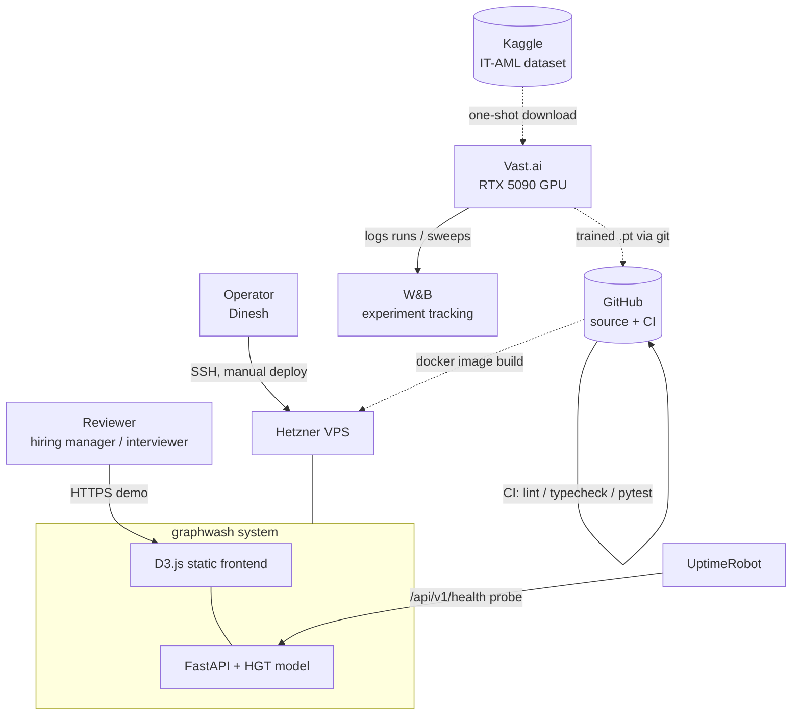
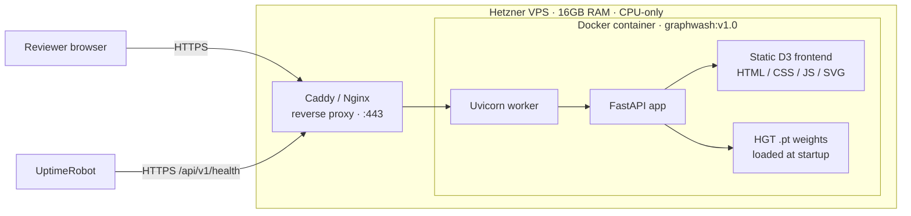

# graphwash — System Diagrams

Three diagrams that support the PRD (`docs/graphwash-prd.md`):

1. **System / context** — external systems and their interaction with graphwash.
2. **Container / deployment** — runtime shape on the Hetzner VPS.
3. **UC1 sequence** — the predict-then-explain happy path from the frontend's perspective.

All diagrams are rendered by GitHub's native Mermaid support.

---

## 1. System / Context



Cross-reference: §9 "Systems touched" in the PRD.

---

## 2. Container / Deployment



Deployment flow: build image locally or in GitHub Actions → push to registry → `docker pull` on Hetzner → swap reverse-proxy upstream (`/beta` staging → root prod). Rollback: re-run the previous tag (§17 Rollback procedure).

Cross-reference: §17 Phase 5a/5b + §9a Delivery model.

---

## 3. UC1 Sequence — Predict then Explain

```mermaid
sequenceDiagram
    actor R as Reviewer
    participant FE as D3 Frontend
    participant API as FastAPI /predict
    participant M as HGT model (in-memory)
    participant EX as FastAPI /explain

    R->>FE: Load demo; click "Analyze"
    FE->>API: POST /api/v1/predict<br/>{nodes, edges}
    API->>API: Validate payload (Pydantic v2)
    API->>API: Lift to PyG HeteroData
    API->>M: forward(HeteroData)
    M-->>API: per-edge illicit_prob + final-layer attention
    API-->>FE: {per_edge: [{edge_id, prob, tier, top10_attention}],<br/>latency_ms}
    FE->>FE: Highlight HIGH / MEDIUM edges red (§7 thresholds)

    R->>FE: Click a flagged edge
    FE->>EX: GET /api/v1/explain/{edge_id}
    EX->>EX: Look up cached k-hop subgraph
    EX-->>FE: {subgraph, per_edge_attention, node_type_summary}
    FE->>FE: Render explanation panel
```

Happy-path focus. Edge cases (expired `edge_id`, weak attention signal, malformed ID) map to §15 and the §7 UC3 edge cases.

Cross-reference: §7 UC1 + UC3 + §8 REQ-010 / REQ-011 / REQ-013.

---
