# graphwash — Task List

**Version:** v0.1 (Draft)
**Last updated:** 2026-04-20
**Status:** Ready for author review
**Author:** Dinesh
**Design spec:** `docs/superpowers/specs/2026-04-18-graphwash-task-list-design.md`

**Linked docs:**

- `docs/graphwash-prd.md` — source of truth for WHAT is built
- `docs/graphwash-diagrams.md` — system / deployment / UC1 Mermaid diagrams
- `docs/adr/` — ADR-0001..0005
- `docs/dev-guide.md` — local setup, testing, conventions

---

## Legend

Every task in this document uses this schema. No optional fields — if a slot does not apply, write `—`.

```
### T-NNN — <imperative title> [kind:<kind>]
Phase:        <Pilot | 0 | 1 | 2 | 3 | 4 | 5a | 5b>
Links:        REQ-XXX, ADR-XXXX, S-XX, Q-XX   (— if none)
BlockedBy:    T-NNN, T-NNN                    (— if none)
Blocks:       T-NNN, T-NNN                    (— if none)
Estimate:     <0.25d | 0.5d | 1d | 2d | 3d>
Status:       pending | in_progress | done | blocked | deferred

What:
  1-3 line description of the user-visible outcome.

Approach / Files:
  - path/to/file.py       :: symbol or purpose
  - tests/path/test_*.py  :: what it asserts

Acceptance:
  [ ] Check 1 (observable, testable)
  [ ] Check 2
  [ ] ruff + mypy --strict clean; pytest green
  [ ] Conventional commit landed on a PR into main
```

### `kind:` vocabulary

| kind       | meaning                                                              |
| ---------- | -------------------------------------------------------------------- |
| `impl`     | production code change                                               |
| `test`     | test-only addition (integration, fixture, property)                  |
| `infra`    | CI, Dockerfile, hooks, repo config, GitHub settings                  |
| `docs`     | README, BENCHMARKS, ADR, dev-guide, PRD updates                      |
| `spike`    | throwaway investigation (S-01..S-04)                                 |
| `decision` | open-question closeout task (Q-03..Q-07)                             |
| `ops`      | deployment, monitoring wiring, rollback rehearsal                    |
| `gate`     | phase-boundary verification task (quotes PRD §17 criterion verbatim) |

### `Status:` values

`pending` → `in_progress` → `done`; `blocked` is a sideways state that unblocks back to `in_progress`; `deferred` is an explicit post-v1 punt logged in PRD §18.

### Estimate buckets

`0.25d | 0.5d | 1d | 2d | 3d` only. Anything >3d must be split.

### Parallelism rules

- Test tasks may start once their upstream impl task is `in_progress`.
- Docs tasks may start once their upstream impl task is `done`.

---

## Phase skeleton

```mermaid
flowchart LR
    Pilot["Pilot<br/>~6.75d<br/>T-001..T-021"]:::pilot
    P0["Phase 0<br/>Env & Data<br/>~3.25d"]:::p0
    P1["Phase 1<br/>GraphSAGE<br/>~3.25d"]:::p1
    P2["Phase 2<br/>HGT<br/>~5.25d"]:::p2
    P3["Phase 3<br/>API<br/>~3.75d"]:::p3
    P4["Phase 4<br/>Frontend<br/>~3.75d"]:::p4
    P5a["Phase 5a<br/>Staging /beta<br/>~2.25d"]:::p5a
    P5b["Phase 5b<br/>Promote<br/>~1.25d"]:::p5b

    Pilot --> P0 --> P1 --> P2 --> P3 --> P4 --> P5a --> P5b

    classDef pilot fill:#e8e8e8,stroke:#555
    classDef p0 fill:#d6e4ff,stroke:#345
    classDef p1 fill:#c3eac3,stroke:#363
    classDef p2 fill:#a4d8a4,stroke:#253
    classDef p3 fill:#ffd9a0,stroke:#853
    classDef p4 fill:#ffc1c1,stroke:#833
    classDef p5a fill:#e0b8ff,stroke:#534
    classDef p5b fill:#b8a8ff,stroke:#334
```



Spikes and decisions consumed per phase:

| Host phase | Consumes                                         |
| ---------- | ------------------------------------------------ |
| Pilot      | S-03 (Hetzner), S-04 (Caddy + UptimeRobot)       |
| Phase 0    | S-02 (schema, opens), S-01 (CPU latency, closes) |
| Phase 1    | Q-03 (IBM F1 variant)                            |
| Phase 2    | Q-04 (threshold recalibration)                   |
| Phase 3    | —                                                |
| Phase 4    | Q-05 (Figma wireframe review)                    |
| Phase 5a   | Q-06 (IP-level rate limit)                       |
| Phase 5b   | Q-07 (monitoring upgrade — deferred to post-v1)  |

---

## REQ ↔ Task traceability matrix

Source: every task's Links: field. Regenerate when Links: changes.

| REQ-ID   | Phase | Covered by                               | Task count |
| -------- | ----- | ---------------------------------------- | ---------- |
| REQ-001  | 0     | T-022, T-023, T-024, T-027               | 4          |
| REQ-002  | 0     | T-025                                    | 1          |
| REQ-003  | 0     | T-026, T-038                             | 2          |
| REQ-004  | 1     | T-031, T-032, T-034                      | 3          |
| REQ-005  | 1     | T-033                                    | 1          |
| REQ-030  | 1     | T-032                                    | 1          |
| REQ-006  | 2     | T-037, T-044                             | 2          |
| REQ-007  | 2     | T-038, T-044                             | 2          |
| REQ-008  | 2     | T-040, T-042, T-045                      | 3          |
| REQ-009  | 2     | T-043, T-046                             | 2          |
| REQ-010  | 2     | T-041, T-051                             | 2          |
| REQ-011  | 2     | T-041, T-051                             | 2          |
| REQ-031  | 2     | T-039, T-040, T-045                      | 3          |
| REQ-012  | 3     | T-050, T-052, T-055                      | 3          |
| REQ-013  | 3     | T-047, T-050, T-055                      | 3          |
| REQ-013a | 3     | T-047, T-048, T-050, T-051, T-052, T-055 | 6          |
| REQ-014  | 3     | T-047, T-048, T-050, T-055               | 4          |
| REQ-015  | 3     | T-049, T-055                             | 2          |
| REQ-016  | 3     | T-053, T-055                             | 2          |
| REQ-034  | 3     | T-050, T-054, T-055                      | 3          |
| REQ-042  | 3     | T-052, T-055                             | 2          |
| REQ-017  | 4     | T-058, T-059, T-060, T-061, T-065        | 5          |
| REQ-018  | 4     | T-059, T-065                             | 2          |
| REQ-019  | 4     | T-062, T-065                             | 2          |
| REQ-033  | 4     | T-063, T-065                             | 2          |
| REQ-040  | 4     | T-064 (deferred to v1.0.1), T-065        | 2          |
| REQ-041  | 4     | T-064 (deferred to v1.0.1), T-065        | 2          |
| REQ-020  | 5a    | T-068                                    | 1          |
| REQ-021  | 5a    | T-069, T-070, T-071                      | 3          |
| REQ-032  | 5b    | T-030, T-033, T-043, T-076               | 4          |

---

## Open Questions register

Mirrors PRD §18. Each question is closed by a `kind:decision` task whose acceptance includes striking the PRD §18 row.

| Q-ID | Question (summary)                                   | Owner  | Target     | Closed by task   |
| ---- | ---------------------------------------------------- | ------ | ---------- | ---------------- |
| Q-03 | IBM Multi-GNN F1 baseline variant (Medium vs. Small) | Dinesh | 2026-04-30 | T-030            |
| Q-04 | Risk-tier threshold recalibration post-training      | Dinesh | 2026-05-02 | T-036            |
| Q-05 | Figma wireframe review for D3 frontend               | Dinesh | 2026-05-10 | T-057            |
| Q-06 | IP-level rate limit for v1                           | Dinesh | 2026-05-15 | T-067            |
| Q-07 | Monitoring upgrade to Grafana/Prometheus             | Dinesh | 2026-06-01 | T-073 (deferred) |

---

## Spike register

Mirrors PRD §11a. S-01..S-04 each have a host task whose acceptance includes striking the PRD §11a row. R-01 and R-02 are ACCEPTED RISK items resolved at the Phase 2 exit gate.

| S-ID | Unknown (summary)                                   | Status        | Target            | Host task        |
| ---- | --------------------------------------------------- | ------------- | ----------------- | ---------------- |
| S-00 | CUDA 13.1 + PyTorch 2.8.0+cu128 + PyG 2.7.0 compat  | DONE          | closed 2026-04-18 | —                |
| S-01 | CPU p95 latency < 200 ms on 500-edge subgraph       | MUST RUN      | 2026-04-22        | T-028            |
| S-02 | IT-AML Medium schema matches NeurIPS 2023 paper     | MUST RUN      | 2026-04-22        | T-022            |
| S-03 | Hetzner VPS + Docker + Caddy viability (hel1-dc2 8 GB reuse) | DONE | closed 2026-04-21 | T-019            |
| S-04 | Caddy per-IP rate limit + UptimeRobot 5-min cadence | DONE          | closed 2026-04-21 | T-020            |
| R-01 | HGT beats IBM Multi-GNN baseline (F1 ≥ 0.72)        | ACCEPTED RISK | end of Phase 2    | T-046 (resolved) |
| R-02 | HGT attention weights non-degenerate                | ACCEPTED RISK | end of Phase 2    | T-046 (resolved) |

---

## Estimate roll-up

Source: sum of `Estimate:` fields per phase, with absorption applied per spec §4.3 Parallelism rules.

| Phase    | Raw estimate | kind:test tasks | kind:docs tasks | Actual (cal days)           | Notes                                  |
| -------- | ------------ | --------------- | --------------- | --------------------------- | -------------------------------------- |
| Pilot    | 7.75d        | 0               | 0.75d           | 3d (2026-04-19..2026-04-21) | T-015 (PR status aggregator) added +1d |
| Phase 0  | 3.25d        | 0.25d           | 0               | —                           | T-024 bumped 0.5d → 1d (ADR-0008)      |
| Phase 1  | 3.25d        | 0.25d           | 0.5d            | —                           |                                        |
| Phase 2  | 5.25d        | 0.25d           | 0.75d           | —                           | T-040 reduced 1d → 0.5d (Task 14 trim) |
| Phase 3  | 3.75d        | 0.5d            | 0               | —                           |                                        |
| Phase 4  | 3.75d        | 0.25d           | 0.25d           | —                           | T-064 deferred (Task 14 trim)          |
| Phase 5a | 2.25d        | 0               | 0               | —                           |                                        |
| Phase 5b | 1.25d        | 0               | 0.25d           | —                           |                                        |

| Aggregate                                            | Value                                                 |
| ---------------------------------------------------- | ----------------------------------------------------- |
| **Raw total**                                        | 30.5d                                                 |
| Test total (full absorption)                         | 1.5d                                                  |
| Docs total (50% absorption)                          | 2.5d                                                  |
| Total absorption                                     | 2.75d                                                 |
| **Focused total**                                    | 27.25d                                                |
| **Focused-day budget (PRD §19, updated 2026-04-18)** | ~26d (renegotiated from 13-20d)                       |
| **Budget headroom**                                  | -1.25d (over budget; pressure acknowledged in §trim)  |

### Trim pass applied

- T-064 (Load-demo button + sample endpoints, REQ-040/REQ-041) moved to `Status: deferred`; deferred to v1.0.1. Removed 0.5d from Phase 4 raw.
- T-040 (sweep execution) estimate reduced from 1d to 0.5d (≥6 runs instead of ≥12); acceptance bullet "≥ 12 sweep runs" → "≥ 6 sweep runs". Removed 0.5d from Phase 2 raw.
- T-065 (cross-browser smoke test) scope reduced to Chrome + Firefox only; Safari acceptance bullet dropped with note "Safari dropped per Task 14 trim pass; deferred to v1.0.1". No estimate change (0.25d).
- Trims applied cumulatively: raw 30.0d → 29.0d; focused 27.25d → 26.25d. T-015 (PR status aggregator, 1d, added 2026-04-20 post-T-009) re-expanded raw to 30.0d and focused to 27.25d. Focused total exceeds the ~26d renegotiated budget by 1.25d and exceeds the original 20d upper bound by 7.25d after exhausting the Task 14 priority list; surfacing as a WARN for Dinesh — further trims or budget renegotiation required before Phase 6 unblock.

**2026-04-18 renegotiation:** PRD §19 budget renegotiated from 13-20d to ~26d focused to match the granular task-list reality. Deadline feasibility: ~2d gap vs the 2026-05-31 window, mitigated by background-clock soak time (T-070) and parallel Vast.ai spikes. Further-trim candidates logged in PRD §19 feasibility note.

---

## Full task DAG

Regenerated by hand from every task's `BlockedBy:` field. Re-run whenever a `BlockedBy:` field is added, removed, or reordered.

```mermaid
flowchart LR
    T001[T-001<br/>Create repo]:::pilot
    T002[T-002<br/>Branch protection]:::pilot
    T003[T-003<br/>CODEOWNERS SECURITY LICENSE]:::pilot
    T004[T-004<br/>README skeleton]:::pilot
    T005[T-005<br/>editorconfig gitignore]:::pilot
    T006[T-006<br/>pyproject Ruff mypy]:::pilot
    T007[T-007<br/>pre-commit hooks]:::pilot
    T008[T-008<br/>pre-push hooks]:::pilot
    T009[T-009<br/>GitHub Actions CI]:::pilot
    T010[T-010<br/>Dependabot config]:::pilot
    T011[T-011<br/>Docker CI stub]:::pilot
    T012[T-012<br/>Label set]:::pilot
    T013[T-013<br/>Issue templates]:::pilot
    T014[T-014<br/>PR template]:::pilot
    T015[T-015<br/>PR status aggregator]:::pilot
    T019[T-019<br/>Hetzner provision]:::pilot
    T020[T-020<br/>Caddy rate-limit]:::pilot
    T021{T-021<br/>Pilot gate}:::pilot
    T022[T-022<br/>IT-AML schema]:::p0
    T023[T-023<br/>Kaggle dataset download]:::p0
    T024[T-024<br/>HeteroData construction]:::p0
    T025[T-025<br/>Stratified splits]:::p0
    T026[T-026<br/>Class weights]:::p0
    T027[T-027<br/>Graph statistics validation]:::p0
    T028[T-028<br/>Tiny HGT latency]:::p0
    T029{T-029<br/>Phase 0 gate}:::p0
    T030[T-030<br/>Decide baseline variant]:::p1
    T031[T-031<br/>GraphSAGE model]:::p1
    T032[T-032<br/>Training loop WandB]:::p1
    T033[T-033<br/>Test eval BENCHMARKS]:::p1
    T034[T-034<br/>Integration test GraphSAGE]:::p1
    T035{T-035<br/>Phase 1 gate}:::p1
    T036[T-036<br/>Decide threshold recalibration]:::p2
    T037[T-037<br/>HGTConv encoder]:::p2
    T038[T-038<br/>Training loop HGT]:::p2
    T039[T-039<br/>WandB Sweep config]:::p2
    T040[T-040<br/>Sweep execution]:::p2
    T041[T-041<br/>Attention extraction]:::p2
    T042[T-042<br/>Model artifact serialization]:::p2
    T043[T-043<br/>HGT eval BENCHMARKS]:::p2
    T044[T-044<br/>Integration test HGT]:::p2
    T045[T-045<br/>Training runbook ADR]:::p2
    T046{T-046<br/>Phase 2 gate}:::p2
    T047[T-047<br/>Pydantic models]:::p3
    T048[T-048<br/>Error envelope 422]:::p3
    T049[T-049<br/>Model load startup]:::p3
    T050[T-050<br/>POST predict endpoint]:::p3
    T051[T-051<br/>GET explain endpoint]:::p3
    T052[T-052<br/>Health metrics endpoints]:::p3
    T053[T-053<br/>Static file serving]:::p3
    T054[T-054<br/>Server-side latency]:::p3
    T055[T-055<br/>Integration test UC1-UC4]:::p3
    T056{T-056<br/>Phase 3 gate}:::p3
    T057[T-057<br/>Decide Figma review]:::p4
    T058[T-058<br/>D3 force graph]:::p4
    T059[T-059<br/>Node edge styling]:::p4
    T060[T-060<br/>Side panel interactions]:::p4
    T061[T-061<br/>API wiring frontend]:::p4
    T062[T-062<br/>Model performance panel]:::p4
    T063[T-063<br/>Architecture SVG]:::p4
    T064[T-064<br/>Load-demo button]:::p4
    T065[T-065<br/>Cross-browser smoke test]:::p4
    T066{T-066<br/>Phase 4 gate}:::p4
    T067[T-067<br/>Decide rate limit]:::p5a
    T068[T-068<br/>Production Dockerfile]:::p5a
    T069[T-069<br/>Deploy to beta]:::p5a
    T070[T-070<br/>Soak testing]:::p5a
    T071[T-071<br/>Monitoring verification]:::p5a
    T072{T-072<br/>Phase 5a gate}:::p5a
    T073[T-073<br/>Defer monitoring upgrade]:::p5b
    T074[T-074<br/>Retag v1.0 image]:::p5b
    T075[T-075<br/>Switch upstream root]:::p5b
    T076[T-076<br/>README finalisation]:::p5b
    T077{T-077<br/>v1.0 ship gate}:::p5b

    T001 --> T002
    T001 --> T003
    T003 --> T004
    T001 --> T005
    T005 --> T006
    T002 --> T007
    T006 --> T007
    T007 --> T008
    T002 --> T009
    T006 --> T009
    T009 --> T010
    T009 --> T011
    T009 --> T015
    T001 --> T012
    T012 --> T013
    T013 --> T014
    T011 --> T019
    T019 --> T020
    T001 --> T021
    T002 --> T021
    T003 --> T021
    T004 --> T021
    T005 --> T021
    T006 --> T021
    T007 --> T021
    T008 --> T021
    T009 --> T021
    T010 --> T021
    T011 --> T021
    T012 --> T021
    T013 --> T021
    T014 --> T021
    T019 --> T021
    T020 --> T021
    T021 --> T022
    T022 --> T023
    T023 --> T024
    T024 --> T025
    T025 --> T026
    T024 --> T027
    T024 --> T028
    T022 --> T029
    T023 --> T029
    T024 --> T029
    T025 --> T029
    T026 --> T029
    T027 --> T029
    T028 --> T029
    T029 --> T030
    T029 --> T031
    T031 --> T032
    T026 --> T032
    T032 --> T033
    T030 --> T033
    T031 --> T034
    T032 --> T034
    T030 --> T035
    T031 --> T035
    T032 --> T035
    T033 --> T035
    T034 --> T035
    T035 --> T036
    T035 --> T037
    T028 --> T037
    T037 --> T038
    T026 --> T038
    T032 --> T038
    T038 --> T039
    T039 --> T040
    T037 --> T041
    T036 --> T041
    T040 --> T042
    T041 --> T043
    T042 --> T043
    T030 --> T043
    T037 --> T044
    T038 --> T044
    T041 --> T044
    T043 --> T045
    T036 --> T046
    T037 --> T046
    T038 --> T046
    T039 --> T046
    T040 --> T046
    T041 --> T046
    T042 --> T046
    T043 --> T046
    T044 --> T046
    T045 --> T046
    T046 --> T047
    T047 --> T048
    T042 --> T049
    T047 --> T049
    T047 --> T050
    T048 --> T050
    T049 --> T050
    T036 --> T050
    T047 --> T051
    T049 --> T051
    T041 --> T051
    T047 --> T052
    T049 --> T052
    T049 --> T053
    T050 --> T054
    T050 --> T055
    T051 --> T055
    T052 --> T055
    T053 --> T055
    T054 --> T055
    T047 --> T056
    T048 --> T056
    T049 --> T056
    T050 --> T056
    T051 --> T056
    T052 --> T056
    T053 --> T056
    T054 --> T056
    T055 --> T056
    T056 --> T057
    T057 --> T058
    T058 --> T059
    T058 --> T060
    T058 --> T061
    T059 --> T061
    T060 --> T061
    T050 --> T061
    T051 --> T061
    T043 --> T062
    T056 --> T063
    T061 --> T064
    T024 --> T064
    T059 --> T065
    T060 --> T065
    T061 --> T065
    T062 --> T065
    T063 --> T065
    T064 --> T065
    T057 --> T066
    T058 --> T066
    T059 --> T066
    T060 --> T066
    T061 --> T066
    T062 --> T066
    T063 --> T066
    T064 --> T066
    T065 --> T066
    T066 --> T067
    T019 --> T067
    T020 --> T067
    T066 --> T068
    T068 --> T069
    T067 --> T069
    T019 --> T069
    T069 --> T070
    T069 --> T071
    T067 --> T072
    T068 --> T072
    T069 --> T072
    T070 --> T072
    T071 --> T072
    T072 --> T073
    T072 --> T074
    T074 --> T075
    T075 --> T076
    T004 --> T076
    T043 --> T076
    T073 --> T077
    T074 --> T077
    T075 --> T077
    T076 --> T077

    classDef pilot fill:#e8e8e8,stroke:#555
    classDef p0 fill:#d6e4ff,stroke:#345
    classDef p1 fill:#c3eac3,stroke:#363
    classDef p2 fill:#a4d8a4,stroke:#253
    classDef p3 fill:#ffd9a0,stroke:#853
    classDef p4 fill:#ffc1c1,stroke:#833
    classDef p5a fill:#e0b8ff,stroke:#534
    classDef p5b fill:#b8a8ff,stroke:#334
```



---

## Pilot Phase — Repo & Infrastructure

**Budget:** ~6.75d | **Tasks:** T-001..T-021 | **REQs:** — (infra only)

### Purpose

Establish the portfolio-grade open-source baseline that every later phase depends on: GitHub repo with protections, CI that enforces the Python standards, pre-commit/pre-push hooks, label taxonomy, issue/PR templates, and two infrastructure spikes (S-03, S-04) that retire Phase 5 risks before implementation begins.

### Entry gate

None. This is the first phase.

### Tasks

### T-001 — Create GitHub repo + set description/topics/social preview [kind:infra]

Phase: Pilot
Links: —
BlockedBy: —
Blocks: T-002, T-003, T-005, T-012
Estimate: 0.25d
Status: done

What:
Public GitHub repo for graphwash with description, topics, and social preview set.

Approach / Files:

- GitHub UI or `gh repo create` :: repo name, description, visibility public
- Settings → General :: topics (graph-ml, aml, pytorch-geometric, hgt, fastapi)
- Settings → Social preview :: upload preview PNG

Acceptance:
[x] Repo public at github.com/<owner>/graphwash
[x] Description set (1-line project pitch)
[x] Topics ≥ 3 including graph-ml, aml, pytorch-geometric
[x] Social preview image uploaded
[x] Conventional commit landed on a PR into main

### T-002 — Branch protection on `main` [kind:infra]

Phase: Pilot
Links: —
BlockedBy: T-001
Blocks: T-007, T-009
Estimate: 0.25d
Status: done

What:
Protect `main` so every change lands via PR with green CI, linear history, no force-pushes.

Approach / Files:

- Settings → Branches → Add rule for `main`
- Rules: require PR before merge, require CI checks to pass, require linear history, block force-push, no bypass for admins

Acceptance:
[x] Rule "require pull request" enabled
[x] Rule "require status checks to pass" enabled (checks added after T-009)
[x] Rule "require linear history" enabled
[x] Rule "do not allow force pushes" enabled
[x] Admin bypass disabled
[x] Conventional commit landed on a PR into main

### T-003 — Add CODEOWNERS, SECURITY.md, LICENSE (MIT) [kind:docs]

Phase: Pilot
Links: —
BlockedBy: T-001
Blocks: T-004
Estimate: 0.25d
Status: done

What:
Portfolio-grade baseline files: ownership, security contact, open-source licence.

Approach / Files:

- .github/CODEOWNERS :: `* @<dinesh-handle>`
- SECURITY.md :: how to report security issues (private contact)
- LICENSE :: MIT, year 2026, Dinesh Dawonauth

Acceptance:
[x] `.github/CODEOWNERS` committed
[x] `SECURITY.md` committed
[x] `LICENSE` committed (MIT text verbatim)
[x] ruff + mypy --strict clean; pytest green
[x] Conventional commit landed on a PR into main

### T-004 — README skeleton [kind:docs]

Phase: Pilot
Links: —
BlockedBy: T-003
Blocks: T-076
Estimate: 0.5d
Status: done

What:
README.md scaffold with badges row, benchmark placeholder, demo link placeholder, architecture slot, setup section, links to PRD/dev-guide/ADRs.

Approach / Files:

- README.md :: title, one-line pitch, badges (CI / license / python), BENCHMARKS placeholder row, demo URL placeholder, architecture diagram slot, Setup section (uv sync, pytest), Links section to `docs/graphwash-prd.md`, `docs/dev-guide.md`, `docs/adr/`

Acceptance:
[x] README.md committed
[x] Badges row renders (CI badge may show "unknown" until T-009 runs once)
[x] BENCHMARKS placeholder table present
[x] Links section resolves to existing files
[x] Conventional commit landed on a PR into main

### T-005 — Add `.editorconfig`, `.gitignore`, `.gitattributes` [kind:infra]

Phase: Pilot
Links: —
BlockedBy: T-001
Blocks: T-006
Estimate: 0.25d
Status: done

What:
Editor/whitespace consistency and Python-aware ignore/attribute rules.

Approach / Files:

- .editorconfig :: utf-8, LF, 4-space indent for .py, 2-space for .md/.yml
- .gitignore :: standard Python (`__pycache__/`, `.venv/`, `*.pt`, `wandb/`, `.DS_Store`, `dist/`, `build/`, `.pytest_cache/`, `.mypy_cache/`, `.ruff_cache/`)
- .gitattributes :: `* text=auto eol=lf`, `*.pt binary`, `*.png binary`

Acceptance:
[x] `.editorconfig` committed
[x] `.gitignore` committed (covers wandb, .pt weights, caches)
[x] `.gitattributes` committed
[x] Conventional commit landed on a PR into main

### T-006 — `pyproject.toml` Ruff + mypy `--strict` config + uv lockfile policy [kind:infra]

Phase: Pilot
Links: —
BlockedBy: T-005
Blocks: T-007, T-009
Estimate: 0.5d
Status: done

What:
Single pyproject.toml owning dependency management (uv), Ruff full ruleset, mypy strict, Python 3.12 pin. uv lockfile committed.

Approach / Files:

- pyproject.toml :: [project] python ">=3.12,<3.13", [tool.ruff] full ruleset, [tool.mypy] strict=true, [tool.uv] index routing from setup report
- uv.lock :: committed
- docs/dev-guide.md :: updated with uv lockfile policy note

Acceptance:
[x] `pyproject.toml` Ruff config passes on empty package
[x] `mypy --strict` returns clean on empty package
[x] `uv.lock` committed; `uv sync` reproduces env on fresh machine
[x] `docs/dev-guide.md` updated
[x] Conventional commit landed on a PR into main

### T-007 — pre-commit hooks [kind:infra]

Phase: Pilot
Links: —
BlockedBy: T-002, T-006
Blocks: T-008
Estimate: 0.5d
Status: done

What:
Local pre-commit hooks: ruff format, ruff check, conventional-commits message lint, `t-NNN` or `training` scope enforcement, hygiene baseline (trailing-whitespace, EOF, YAML / TOML validation, merge-conflict, large-files, case-conflict).

Approach / Files:

- .pre-commit-config.yaml :: `pre-commit/pre-commit-hooks` hygiene baseline, `astral-sh/ruff-pre-commit` (format + check), `compilerla/conventional-pre-commit` at `commit-msg` stage, `repo: local` scope-enforcement hook at `commit-msg` stage
- scripts/check-commit-scope.sh :: bash script invoked by the scope-enforcement hook; regex-validates commit subject against `type(t-NNN|training): description`
- docs/dev-guide.md :: `pre-commit install` instructions and hook inventory

Acceptance:
[x] `pre-commit install` succeeds
[x] Format violation blocks commit (manual test)
[x] Conventional-commit violation blocks commit (manual test)
[x] Conventional commit landed on a PR into main

### T-008 — pre-push hooks [kind:infra]

Phase: Pilot
Links: —
BlockedBy: T-007
Blocks: T-009
Estimate: 0.25d
Status: done

What:
Pre-push hooks run `mypy --strict` project-wide on `src/` and the full `pytest` suite (without coverage reporting) to catch type regressions and test breakage before push. Ships a minimal `tests/test_smoke.py` so the pytest gate has something to run against.

Approach / Files:

- .pre-commit-config.yaml :: pre-push stage hook invoking `uv run mypy --strict src` project-wide
- .pre-commit-config.yaml :: pre-push stage hook invoking `uv run pytest -q --no-cov`
- tests/test_smoke.py :: new; asserts `graphwash` package importability so the pytest gate has a registered test
- docs/dev-guide.md :: `pre-commit install --hook-type pre-push` instructions, pre-push hook inventory, coverage-on-CI rationale

Acceptance:
[x] Pre-push hook runs `mypy --strict` on `src/`
[x] Pre-push hook runs `pytest` on `git push`
[x] Failing test blocks push (manual test)
[x] `tests/test_smoke.py` collected and green on `uv run pytest -q`
[x] Conventional commit landed on a PR into main

### T-009 — GitHub Actions CI workflow [kind:infra]

Phase: Pilot
Links: —
BlockedBy: T-002, T-006
Blocks: T-010, T-011
Estimate: 0.5d
Status: done

What:
CI workflow running lint + typecheck + test on pull_request and push to main. Turns the branch-protection status checks from "unknown" to required.

Approach / Files:

- .github/workflows/ci.yml :: two jobs on python 3.12 / ubuntu-24.04. `lint` runs `ruff format --check` and `ruff check` via `astral-sh/ruff-action@v3`. `test` runs `uv sync --frozen --extra dev` then `mypy --strict src` then `pytest -q --no-cov` via `astral-sh/setup-uv@v8`. Triggers: `pull_request`, `push: [main]`, `workflow_dispatch`. Concurrency cancels in-flight on same ref. `permissions: contents: read`.
- tests/test_smoke.py already exists from T-008 and provides the CI-green anchor

Acceptance:
[x] CI runs on pull_request
[x] CI runs on push to main
[x] Both `lint` and `test` jobs pass on an empty-code PR
[x] Status checks registered in branch protection (T-002 updated)
[x] Conventional commit landed on a PR into main

### T-010 — Dependabot config [kind:infra]

Phase: Pilot
Links: —
BlockedBy: T-009
Blocks: —
Estimate: 0.25d
Status: done

What:
Automated weekly bumps for `pip` and `github-actions` ecosystems.

Approach / Files:

- .github/dependabot.yml :: schedule: weekly; ecosystems: pip (directory /), github-actions (directory /)

Acceptance:
[x] `.github/dependabot.yml` committed
[x] Dependabot status page shows both ecosystems enabled (evidence: SBOM endpoint lists `pkg:pypi` and `pkg:githubactions` packages; dependabot[bot] PR #18 merged 2026-04-20)
[x] Conventional commit landed on a PR into main (PRs #13, #20)

### T-011 — Docker CI stub (hadolint) [kind:infra]

Phase: Pilot
Links: —
BlockedBy: T-009
Blocks: T-019
Estimate: 0.5d
Status: done

What:
Placeholder Dockerfile + CI workflow that statically lints the Dockerfile on every PR touching Docker paths. Catches Dockerfile regressions before Phase 5. Originally specified as a full `docker build`, pivoted to hadolint in PR #24 after the cold-build cost (~16 min) failed to earn its keep on a stub image; full build returns in Phase 5 when the runtime image has real contents.

Approach / Files:

- Dockerfile :: python:3.12-slim base, `uv sync`, COPY src/, placeholder CMD echoing "v0 stub"
- .github/workflows/docker.yml :: `hadolint/hadolint-action@v3.1.0` on `pull_request` paths `[Dockerfile, .dockerignore, .github/workflows/docker.yml]`, `failure-threshold: error`, no push

Acceptance:
[x] `hadolint Dockerfile` passes locally against the committed Dockerfile
[x] CI workflow lints the Dockerfile on pull_request (evidence: `.github/workflows/docker.yml` `hadolint` job)
[x] No push step present (confirm by reading workflow)
[x] Conventional commit landed on a PR into main (PRs #22, #24)

### T-012 — Label set with hex colours + auto-label workflow [kind:infra]

Phase: Pilot
Links: —
BlockedBy: T-001
Blocks: T-013
Estimate: 0.5d
Status: done

What:
Colour-coded label taxonomy covering phases, REQ-IDs (v1 only), kinds, and sizes, plus a PR auto-label workflow that applies `kind:*` from branch-prefix and `size:*` from changed-lines on every `pull_request_target`. `kind:decision` and `kind:gate` remain manual (content categories, not commit types). `phase:*` and `req:*` are deferred to a proposed T-012.1 follow-up because they require parsing the task-list.

Approach / Files:

- .github/labels.yml :: ~50 labels grouped: `phase:pilot`..`phase:5b` (8), `req:NNN` one per v1 REQ-ID (~29 non-contiguous), `kind:impl|test|infra|docs|spike|decision|ops|gate` (8), `size:xs|s|m|l` (4); hex colours per group
- scripts/sync_labels.sh :: wraps `gh label create` from `.github/labels.yml`
- .github/workflows/pr-label.yml :: `pull_request_target` trigger. Job `kind` runs `actions/labeler@v5` with `configuration-path: .github/labeler.yml` and `sync-labels: true`. Job `size` runs `CodelyTV/pr-size-labeler@v1` with thresholds xs≤10, s≤100, m≤500, l≤1000, xl clamped into `size:l`. Fallback to `pascalgn/size-label-action@v0.5` if CodelyTV breaks post-Node-20-deprecation (action has not released in over a year as of 2026-04).
- .github/labeler.yml :: head-branch regex mapping. `kind:impl` ← `^feat/|^fix/|^refactor/`; `kind:test` ← `^test/`; `kind:infra` ← `^infra/`; `kind:docs` ← `^docs/`; `kind:spike` ← `^spike/`; `kind:ops` ← `^ops/`. `chore/` has no mapping (no `kind:chore` in the taxonomy).
- docs/dev-guide.md :: labeler section + manual-only label dimensions (`phase:*`, `req:*`, `kind:decision`, `kind:gate`)

Acceptance:
[x] `.github/labels.yml` committed
[x] `scripts/sync_labels.sh` creates all labels against the repo (idempotent) (evidence: 62 labels live via `gh api repos/.../labels`)
[x] Each group uses a distinct hex-colour family
[x] `pr-label.yml` applies a `kind:*` label on a new PR from a conventional branch name (feat/fix/refactor/test/infra/docs/spike/ops) (evidence: PR #31 `fix/...` → `kind:impl`; PR #32 `spike/...` → `kind:spike`)
[x] `pr-label.yml` applies a `size:*` label on a new PR from lines changed (evidence: PRs #30–#32 labelled `size:xs`/`size:m`)
[x] Conventional commit landed on a PR into main (PR #25)

### T-013 — Issue templates [kind:infra]

Phase: Pilot
Links: —
BlockedBy: T-012
Blocks: T-014
Estimate: 0.25d
Status: done

What:
Four issue templates surfacing the right fields for each kind of issue.

Approach / Files:

- .github/ISSUE_TEMPLATE/bug.yml :: reproduce, expected, actual, environment
- .github/ISSUE_TEMPLATE/feature.yml :: problem, proposal, alternatives, acceptance
- .github/ISSUE_TEMPLATE/spike.yml :: unknown, method, success criteria, kill signal, target date
- .github/ISSUE_TEMPLATE/docs.yml :: what's wrong, proposed fix, affected pages
- .github/ISSUE_TEMPLATE/config.yml :: `blank_issues_enabled: false`

Acceptance:
[x] All four templates render in "New issue" UI (evidence: `.github/ISSUE_TEMPLATE/{bug,feature,spike,docs}.yml` present and valid)
[x] Blank issues disabled (evidence: `.github/ISSUE_TEMPLATE/config.yml` `blank_issues_enabled: false`)
[x] Conventional commit landed on a PR into main (PR #26)

### T-014 — PR template [kind:infra]

Phase: Pilot
Links: —
BlockedBy: T-013
Blocks: —
Estimate: 0.25d
Status: done

What:
Single PR template with Summary / What changed / How to test / Checklist — enforces a conventional-commits title.

Approach / Files:

- .github/PULL_REQUEST_TEMPLATE.md :: Summary, What changed (bullets), How to test (commands), Checklist (ruff/mypy/pytest passed, conventional-commit title, related task ID)

Acceptance:
[x] Template renders on new PR (evidence: PR #28 onwards used the template sections)
[x] Checklist includes conventional-commit reminder and task-ID link field (evidence: `.github/PULL_REQUEST_TEMPLATE.md` lines 20–21)
[x] Conventional commit landed on a PR into main (PR #27)

### T-015 — PR status aggregator comment workflow [kind:infra]

Phase: Pilot
Links: —
BlockedBy: T-009
Blocks: —
Estimate: 1d
Status: done

What:
Sticky PR comment aggregating workflow statuses (per-job rows for `ci`; one row per other tracked workflow) with a mergeability footer. Listens to `workflow_run` events for `[ci, pr-label, docs-site]` plus `pull_request` opens; upserts a single comment via `marocchino/sticky-pull-request-comment@v2` keyed on `header: graphwash-status`. Soft-depends on T-012: if T-012 has not merged yet, the `pr-label` row simply does not appear until it does. T-011 (Docker CI stub) will amend the `workflows:` filter to add `docker-ci`.

Approach / Files:

- .github/workflows/pr-status.yml :: triggers `workflow_run` for `[ci, pr-label, docs-site]` (`types: [requested, completed]`) and `pull_request` (`types: [opened, synchronize, reopened]`). Single job on `ubuntu-24.04`, `permissions: pull-requests: write, actions: read, contents: read`. Steps: `actions/checkout@v4` → `scripts/resolve-pr-number.sh` (outputs `number` + `sha`) → `scripts/build-pr-status.sh` (outputs `body`) → `marocchino/sticky-pull-request-comment@v2` gated by `if: steps.pr.outputs.number != ''`.
- scripts/resolve-pr-number.sh :: resolves PR number and head SHA across both trigger events. `pull_request`: read from `$GITHUB_EVENT_PATH`. `workflow_run`: read `.workflow_run.pull_requests[0].number` with fallback to `gh pr list --search "$HEAD_SHA" --state open --json number`. Emits `number` and `sha` via `$GITHUB_OUTPUT`.
- scripts/build-pr-status.sh :: queries `gh api /repos/$REPO/actions/runs?head_sha=$HEAD_SHA&per_page=50`; groups by workflow name; picks the run with max `id` per workflow (GitHub run IDs are monotonically increasing); fans out `ci` into per-job rows via `gh api /repos/$REPO/actions/runs/$RUN_ID/jobs`. Status glyphs: ✅ success, ❌ failure, ⏹ cancelled, ⏭ skipped, ⏳ in progress, ➖ neutral. Duration = `updated_at - started_at` rounded to the second (terminal states only; in-progress rows show `—`). Mergeability footer from `gh pr view $PR_NUMBER --json mergeable,mergeStateStatus`: CLEAN → ✅ mergeable; UNSTABLE → ⚠️ mergeable but non-required checks failing; BLOCKED → 🛑 blocked; BEHIND → ⏪ behind main; DIRTY → 💥 merge conflict; UNKNOWN → ⏳ mergeability computing. Race-condition rule: filter all runs by `head_sha == HEAD_SHA` first, then max-ID per workflow.
- docs/dev-guide.md :: short section describing the status comment and its trigger semantics

Acceptance:
[x] `pr-status.yml` deployed; first run posts the sticky comment within 30s of PR open (evidence: sticky comment present on PRs #28–#32)
[x] Comment updates in place on `workflow_run: requested` with an in-progress row for the triggered workflow (evidence: `.github/workflows/pr-status.yml` `types: [requested, completed]`)
[x] Comment updates in place on `workflow_run: completed` with terminal status glyph and duration (evidence: PR #32 sticky renders `[PASS] success | 44s` per-job ci rows)
[x] Mergeability footer reflects current `gh pr view` state across CLEAN / UNSTABLE / BLOCKED / BEHIND / DIRTY / UNKNOWN (evidence: `scripts/build-pr-status.sh:34-38` case block covers all 6 states; CLEAN observed live on PR #32)
[x] Double-push race (two commits within 2s): final rendered comment reflects only the latest SHA's runs (evidence: `scripts/build-pr-status.sh:62-68` filters by `head_sha == $sha` then `max_by(.id)` per workflow)
[x] Conventional commit landed on a PR into main (PRs #28, #31)

### T-019 — S-03 Hetzner provision + Docker smoke test [kind:spike]

Phase: Pilot
Links: S-03, PRD §11a, PRD §18 (Hetzner instance type), ADR-0006
BlockedBy: T-011
Blocks: T-021, T-067
Estimate: 1d
Status: done

What:
Reused the existing hel1-dc2 8 GB VPS (helsinki-paradise) for the graphwash container instead of a dedicated CPX31. Deployed a FastAPI + Pydantic v2 stub in Docker behind Caddy with TLS on graphwash.dineshd.dev. Measured cold-start, idle RAM, health p95, and TLS-issuance time. Closed 2026-04-21.

Approach / Files:

- Method: verbatim from PRD §11a S-03
- docs/ops/hetzner.md :: instance metadata, Caddy site block, measurement evidence
- docs/adr/0006-hetzner-instance-choice.md :: locks the hel1-dc2 8 GB reuse decision

Acceptance:
[x] Cold-start < 30 s (evidence: `docs/ops/hetzner.md` cold-start block, 2.405 to 2.494 s across 5 iterations)
[x] Idle RAM < 2 GB (evidence: `docs/ops/hetzner.md` idle-RAM block, 74.56 MiB steady-state)
[x] Health endpoint p95 < 50 ms (evidence: `docs/ops/hetzner.md` health-p95 block, 49 ms via `ab -n 500 -c 10`)
[x] Caddy TLS issued by Let's Encrypt < 2 min (evidence: `docs/ops/hetzner.md` TLS block, 4.66 s)
[x] PRD §11a S-03 row moved to DONE
[x] Hetzner instance type recorded in `docs/ops/hetzner.md`
[x] ADR-0006 appended (instance choice differs from CPX31 baseline: hel1-dc2 8 GB reuse)
[x] Conventional commit landed on a PR into main (PR #29, merged 2026-04-21)

### T-020 — S-04 Caddy rate-limit + UptimeRobot [kind:spike]

Phase: Pilot
Links: S-04, PRD §11a, PRD §18 Q-06 (feasibility portion)
BlockedBy: T-019
Blocks: T-021, T-067
Estimate: 0.5d
Status: done

What:
Add 5-line Caddy rate-limit block; verify bursts are 429'd. Create UptimeRobot monitor at 2-min cadence; verify alert email reaches dind.dev@gmail.com within §17 response window. Target: 2026-05-06.

Approach / Files:

- ops/Caddyfile :: `rate_limit` block, 10 req/s per IP
- UptimeRobot dashboard :: monitor on `https://<beta-domain>/api/v1/health`, 2-min interval
- docs/ops/monitoring.md :: captured screenshots + alert-email test log

Acceptance:
[x] Rate limit blocks > 10 req/s sustained from single IP (evidence: `hey -n 100 -c 10` output shows 429s)
[x] UptimeRobot free-tier 2-min cadence confirmed (evidence: monitor-config screenshot)
[x] Deliberate container stop triggers alert email within 5 min (evidence: email timestamp)
[x] PRD §11a S-04 row moved to DONE
[x] Conventional commit landed on a PR into main

### T-021 — Pilot exit gate [kind:gate]

Phase: Pilot
Links: spec §8 (Pilot exit gate)
BlockedBy: T-001, T-002, T-003, T-004, T-005, T-006, T-007, T-008, T-009, T-010, T-011, T-012, T-013, T-014, T-015, T-019, T-020
Blocks: T-022
Estimate: 0.25d
Status: done

What:
Verify Pilot exit criteria and record evidence. The Pilot Phase is DONE when (a) the repo is public on GitHub with branch protection live on main, (b) CI runs ruff + mypy + pytest on a trivial smoke test, (c) all non-spike Pilot tasks are merged, (d) S-03 reports DONE in PRD §11a, (e) S-04 reports DONE in PRD §11a.

Approach / Files:

- Record evidence inline in the PR body for T-021
- Update the Estimate roll-up table in this file with Pilot actual

Acceptance:
[x] Repo public with branch protection live on main (evidence: https://github.com/dinesh-git17/graphwash public; branch-protection API reports `enforce_admins: true`, `required_linear_history: true`, `allow_force_pushes: false`, `allow_deletions: false`, required contexts `[lint, test]`; screenshot attached in PR body)
[x] CI runs ruff + mypy + pytest on `tests/test_smoke.py` and reports green (evidence: run https://github.com/dinesh-git17/graphwash/actions/runs/24753657809 on `main@c65bdb6`, conclusion success; `.github/workflows/ci.yml` runs `ruff format --check`, `ruff check`, `mypy --strict src`, `pytest -q --no-cov`)
[x] All non-spike Pilot tasks T-001..T-015 merged into main (evidence: PRs #1–#32; this PR ticks the T-010..T-015 backlog and flips their statuses)
[x] S-03 reports DONE in PRD §11a (evidence: `docs/graphwash-prd.md` §11a table row, closed 2026-04-21)
[x] S-04 reports DONE in PRD §11a (evidence: `docs/graphwash-prd.md` §11a table row, closed 2026-04-21)
[x] Pilot estimate-vs-actual recorded in the Estimate roll-up table
[x] Conventional commit landed on a PR into main

### Spikes and decisions consumed by this phase

| ID   | Consumed by task |
| ---- | ---------------- |
| S-03 | T-019            |
| S-04 | T-020            |

### Explicitly deferred from Pilot (not in v1)

Release Drafter / CHANGELOG automation; Codecov integration; path-based labeler; PR size labeler; `CODE_OF_CONDUCT.md`; commit signing enforcement on main; GitHub Discussions / Wiki / Pages. Logged here so they are not added mid-execution.

---

## Phase 0 — Environment & Data

**Budget:** ~2.75d | **Tasks:** T-022..T-029 | **REQs:** REQ-001, REQ-002, REQ-003

### Purpose

Ship a reproducible data pipeline: IT-AML Medium downloaded and validated against the NeurIPS 2023 paper, a `HeteroData` object constructed with three node types and one edge type, stratified splits preserving the ~2% illicit ratio, and class weights computed. Retires two load-bearing spikes: S-02 (schema matches paper) and S-01 (CPU forward-pass feasibility).

### Entry gate

- [ ] Pilot exit gate (T-021) passed

### Tasks

### T-022 — S-02 IT-AML HI-Medium schema validation [kind:spike]

Phase: 0
Links: S-02, REQ-001, PRD §11a, PRD §18 (struck Q: IT-AML Medium schema)
BlockedBy: T-021
Blocks: T-023
Estimate: 0.5d
Status: done

What:
Validate that the Kaggle IT-AML HI-Medium download matches the schema documented in the NeurIPS 2023 paper. Retires the schema unknown before any data-pipeline code is written. Closed 2026-04-22.

Approach / Files:

- Method: verbatim from PRD §11a S-02 (executed locally; no GPU required)
- src/graphwash/data/schema.py :: captured column names, dtypes, null rates, illicit-label distribution; rename map disambiguates the duplicate `Account` header into `from_account` / `to_account`; docstring records diff vs paper Table 4
- docs/adr/0007-hi-medium-over-li-medium.md :: new ADR locking HI-Medium over LI-Medium

Acceptance:
[x] Schema diff (columns / dtypes / null rate / illicit rate) vs paper recorded in `src/graphwash/data/schema.py` docstring
[x] Rename map captured in `src/graphwash/data/schema.py` (duplicate `Account` header disambiguated to `from_account` / `to_account`)
[x] Illicit label rate matches paper Table 4 HI-Medium (1 per 905) within ±10% relative
[x] PRD §11a S-02 row moved to DONE
[x] Kill signal fired on ~2% illicit assumption; REQ-001, REQ-002, §1, §14 amended; ADR-0007 added; task list updated before T-023
[x] Conventional commit landed on a PR into main

### T-023 — Kaggle credentials + dataset download script [kind:infra]

Phase: 0
Links: REQ-001
BlockedBy: T-022
Blocks: T-024
Estimate: 0.25d
Status: done

What:
Reproducible, one-command dataset download using the Kaggle Python API.

Approach / Files:

- scripts/download_data.py :: zero-arg CLI; calls `kaggle.api.dataset_download_file()` against the HI-Medium slug and extracts the zip Kaggle wraps large files in; `--force` to re-download.
- src/graphwash/data/schema.py :: `DATASET_SLUG` and `RAW_FILENAME` surfaced as `Final[str]` constants for the script and future loaders.
- docs/dev-guide.md :: §2 Kaggle credentials block (kaggle.json local, env vars for training hosts); §6 Training invocation updated to zero-arg.

Acceptance:
[x] `uv run python scripts/download_data.py` downloads and extracts IT-AML Medium
[x] `docs/dev-guide.md` updated with credential setup
[x] `data/` added to `.gitignore` (verify T-005 entry)
[x] ruff + mypy --strict clean; pytest green
[x] Conventional commit landed on a PR into main

### T-024 — HeteroData construction [kind:impl]

Phase: 0
Links: REQ-001, ADR-0008
BlockedBy: T-023
Blocks: T-025, T-026, T-027, T-028
Estimate: 1d
Status: in_progress

What:
Build a PyG `HeteroData` object keyed by composite `(bank, account)`
node identity (per ADR-0008) with three node types (`individual`,
`business`, `bank`) and two edge types: `wire_transfer`
(account-to-account, carrying `amount_paid` float32, relative
timestamp int64, cross-currency int8 flag) and `at_bank`
(account-to-bank membership, no per-edge features). Timestamps
encoded as int64 seconds relative to `floor(min(timestamp), day) −
RELATIVE_TIMESTAMP_MARGIN_S` per IBM `format_kaggle_files.py`
reference. `RELATIVE_TIMESTAMP_MARGIN_S = 10` is a module-level
constant in `loader.py`; the dataset epoch is computed per load and
attached to the returned `HeteroData` as
`graphwash_timestamp_epoch_s`.

Approach / Files:

- src/graphwash/data/loader.py :: `build_hetero_data(csv_dir: Path) -> HeteroData` producing composite-keyed per-type node tables, both edge-type indices, per-edge `wire_transfer` features, and module-level `DATASET_EPOCH_OFFSET_S` for the relative timestamp encoding
- src/graphwash/data/node_types.py :: deterministic SHA-256 account-type split applied to composite `(bank, account)` ids; training-data synthesis only (see ADR-0008)
- tests/data/test_loader.py :: 1k-row synthetic fixture CSV; asserts composite-node deduplication (distinct `(bank, account)` pairs land in distinct nodes), both edge-type triplet coverage, every account carries at least one `at_bank` edge to its declared bank, edge-feature dtypes on `wire_transfer`, and an `HGTConv` smoke test producing embeddings for all three node types

Acceptance:
[ ] `build_hetero_data()` returns a PyG `HeteroData` keyed by composite `(bank, account)` identity with three node types and two edge types (`wire_transfer`, `at_bank`) per REQ-001 + ADR-0008
[ ] `wire_transfer` edges carry `amount_paid` (float32), relative timestamp (int64 seconds per ADR-0008), cross-currency flag (int8)
[ ] Every account node has at least one `at_bank` edge to its declared bank
[ ] `HGTConv` smoke test on the built graph produces embeddings for all three node types (no structurally dead type)
[ ] Every canonical `wire_transfer` edge store carries binary
    supervision labels in `.y`, aligned with edge order
[ ] Every node type carries a `float32` feature tensor `x` of shape
    `[N_type, 7]`, derived in a single pass over the raw CSV
    (account feature schema per `loader._compute_account_features`;
    bank feature schema per `loader._compute_bank_features`)
[ ] `RELATIVE_TIMESTAMP_MARGIN_S` module-level constant;
    `graphwash_timestamp_epoch_s` attached to returned `HeteroData`
[ ] `tests/data/test_loader.py` green on 1k-row fixture
[ ] ruff + mypy --strict clean; pytest green
[ ] Conventional commit landed on a PR into main

### T-025 — Stratified train/val/test splits [kind:impl]

Phase: 0
Links: REQ-002
BlockedBy: T-024
Blocks: T-026, T-029
Estimate: 0.25d
Status: pending

What:
Deterministic stratified splits preserving the ~2% illicit ratio across train/val/test.

Approach / Files:

- src/data/splits.py :: `stratified_split(data: HeteroData, ratios: tuple[float, float, float], seed: int) -> tuple[HeteroData, HeteroData, HeteroData]`
- tests/data/test_splits.py :: split sizes sum to 100%; illicit ratio within ±0.5% across splits; seed reproduces splits bit-for-bit

Acceptance:
[ ] Split sizes sum to 100%
[ ] Illicit class ratio preserved within ±0.5% across train/val/test
[ ] Same seed produces identical splits across runs
[ ] ruff + mypy --strict clean; pytest green
[ ] Conventional commit landed on a PR into main

### T-026 — Class weight computation [kind:impl]

Phase: 0
Links: REQ-003
BlockedBy: T-025
Blocks: T-029, T-032, T-038
Estimate: 0.25d
Status: pending

What:
Compute positive-class weight from the training split label distribution for weighted cross-entropy.

Approach / Files:

- src/data/class_weights.py :: `compute_pos_weight(train_labels: torch.Tensor) -> float` = negative-count / positive-count
- tests/data/test_class_weights.py :: weight ≈ neg/pos count on fixture; dtype float32

Acceptance:
[ ] `compute_pos_weight()` returns neg/pos ratio
[ ] Test with synthetic 98/2 split returns ≈ 49.0
[ ] ruff + mypy --strict clean; pytest green
[ ] Conventional commit landed on a PR into main

### T-027 — Graph statistics validation vs paper [kind:test]

Phase: 0
Links: REQ-001, S-02, ADR-0008
BlockedBy: T-024
Blocks: T-029
Estimate: 0.25d
Status: pending

What:
Integration test asserting aggregate graph statistics match the paper reference values captured in `src/graphwash/data/schema.py` (from S-02) within stated tolerances. Per-type counts are NOT asserted against paper: the paper publishes no `individual`/`business`/`bank` breakdown and the three-type split in graphwash is a training-data synthesis per ADR-0008.

Approach / Files:

- tests/data/test_graph_stats.py :: compares live aggregate counts from `build_hetero_data()` against `schema.TOTAL_TRANSACTIONS`, `schema.LAUNDERING_TRANSACTIONS`, and `schema.ILLICIT_FRACTION`; records per-type node and edge counts in the test output as informational context (no hard gate)

Acceptance:
[ ] Total `wire_transfer` edge count matches `schema.TOTAL_TRANSACTIONS` within ±5%
[ ] Total laundering edge count matches `schema.LAUNDERING_TRANSACTIONS` within ±5%
[ ] Illicit fraction matches `schema.ILLICIT_FRACTION` within ±0.5 percentage points
[ ] Per-type node counts and `at_bank` edge count logged to test output (informational; no paper reference to compare against)
[ ] Reference constants in `src/graphwash/data/schema.py` cited in test assertion messages
[ ] ruff + mypy --strict clean; pytest green
[ ] Conventional commit landed on a PR into main

### T-028 — S-01 Tiny HGT CPU latency micro-spike [kind:spike]

Phase: 0
Links: S-01, PRD §11a, PRD §4 pillar 3, PRD §9 Performance, PRD §13 risk 4
BlockedBy: T-024
Blocks: T-029, T-037
Estimate: 0.5d
Status: pending

What:
Train a tiny HGT (1 layer, 16 hidden, 2 heads) on a 1k-edge subset for ~5 epochs on Vast.ai. Export weights. On a laptop CPU, run forward passes over a 500-edge subgraph 100 times; record p50/p95/p99. Retires the CPU-latency unknown before committing to full HGT in Phase 2. Target: 2026-04-22.

Approach / Files:

- Method: verbatim from PRD §11a S-01
- docs/spikes/s-01-cpu-latency.md :: methodology, commit SHAs, p50/p95/p99 numbers, kill-signal evaluation
- docs/adr/000X-hgt-cpu-architecture.md :: appended only if kill signal fires (tiny p95 > 200 ms)

Acceptance:
[ ] Tiny HGT trained (1 layer, 16 hidden, 2 heads) on 1k-edge subset, ~5 epochs
[ ] CPU forward-pass p50/p95/p99 over 100 runs on a 500-edge subgraph recorded in `docs/spikes/s-01-cpu-latency.md`
[ ] Success path: tiny p95 < 100 ms (leaves headroom for 4× scale-up under 200 ms)
[ ] Kill signal evaluated: if tiny p95 > 200 ms, ADR-000X appended with architecture revision before Phase 2
[ ] PRD §11a S-01 row moved to DONE
[ ] Conventional commit landed on a PR into main

### T-029 — Phase 0 exit gate [kind:gate]

Phase: 0
Links: PRD §17 Phase 0 gate
BlockedBy: T-022, T-023, T-024, T-025, T-026, T-027, T-028
Blocks: T-030
Estimate: 0.25d
Status: pending

What:
Verify Phase 0 exit criteria and record evidence. Quoted verbatim from PRD §17 Phase 0: "HeteroData object constructed and graph statistics match paper documentation within ±5%."

Approach / Files:

- Record evidence inline in the PR body for T-029
- Update the Estimate roll-up table in this file with Phase 0 actual

Acceptance:
[ ] `HeteroData` object constructed and graph statistics match paper documentation within ±5% (evidence: `tests/data/test_graph_stats.py` green; counts in PR description)
[ ] S-01 and S-02 both reporting DONE in PRD §11a
[ ] Phase 0 estimate-vs-actual recorded in the Estimate roll-up table
[ ] Conventional commit landed on a PR into main

### Spikes and decisions consumed by this phase

| ID   | Consumed by task |
| ---- | ---------------- |
| S-02 | T-022            |
| S-01 | T-028            |

---

## Phase 1 — GraphSAGE Baseline

**Budget:** ~3.25d | **Tasks:** T-030..T-035 | **REQs:** REQ-004, REQ-005, REQ-030

### Purpose

Establish a homogeneous GraphSAGE baseline with full W&B logging as the floor that HGT must clear. Functions as the "Act 1" of the two-act narrative and as the gate that surfaces data-pipeline bugs before investing training budget on HGT.

### Entry gate

- [ ] Phase 0 exit gate (T-029) passed

### Tasks

### T-030 — Decide: IBM Multi-GNN F1 baseline variant [kind:decision]

Phase: 1
Links: Q-03, PRD §18, REQ-032, BENCHMARKS.md
BlockedBy: T-029
Blocks: T-033, T-043
Estimate: 0.25d
Status: pending

What:
Confirm which IBM Multi-GNN F1 number we compare against (Medium vs. Small) and record the decision. Target: 2026-04-30. Owner: Dinesh.

Approach / Files:

- BENCHMARKS.md :: paper citation (page, table) and chosen variant recorded
- docs/graphwash-prd.md :: PRD §18 Q-03 struck-through
- docs/adr/000X-ibm-baseline-variant.md :: appended only if chosen variant changes PRD §4 goal targets

Acceptance:
[ ] Paper figure (page, table, dataset variant) cited in `BENCHMARKS.md`
[ ] PRD §18 Q-03 struck-through with resolution note
[ ] ADR-000X appended if the answer changes PRD §4 targets
[ ] Conventional commit landed on a PR into main

### T-031 — GraphSAGE model implementation [kind:impl]

Phase: 1
Links: REQ-004
BlockedBy: T-029
Blocks: T-032, T-034
Estimate: 1d
Status: pending

What:
2-layer homogeneous GraphSAGE encoder. Collapses heterogeneous node types into a unified feature vector for the baseline.

Approach / Files:

- src/models/graphsage.py :: `GraphSAGEBaseline(nn.Module)` — 2 `SAGEConv` layers, ReLU + dropout, final linear classifier head
- src/models/homogenize.py :: helper that concatenates per-type features into one node tensor and remaps edge_index to the collapsed node space
- tests/models/test_graphsage.py :: forward pass on fixture returns (N, 2) logits; backward runs without NaN

Acceptance:
[ ] `GraphSAGEBaseline` forward pass returns logits of shape (num_nodes, 2)
[ ] Backward pass completes without NaN on fixture graph
[ ] Unit tests green
[ ] ruff + mypy --strict clean; pytest green
[ ] Conventional commit landed on a PR into main

### T-032 — Training loop + W&B logging [kind:impl]

Phase: 1
Links: REQ-004, REQ-030
BlockedBy: T-031, T-026
Blocks: T-033, T-034, T-038
Estimate: 1d
Status: pending

What:
Generic `Trainer` wrapping model / optimizer / loader / W&B. Configured for GraphSAGE via YAML. Logs per-epoch train/val loss, minority F1, precision, recall, AUC, LR, and attention weight histograms (N/A for SAGE; present for HGT reuse).

Approach / Files:

- src/training/trainer.py :: `Trainer(model, loader, optimizer, loss_fn, wandb_run, cfg)` with train/validate/evaluate methods
- src/training/metrics.py :: minority F1, precision, recall, AUC; reusable across models
- configs/graphsage-v1.yaml :: hparams (lr, epochs, hidden dim, dropout, seed)
- src/training/run_graphsage.py :: CLI entry `uv run python -m src.training.run_graphsage --config configs/graphsage-v1.yaml`
- tests/training/test_trainer.py :: 2-epoch smoke run on fixture graph finishes without NaN

Acceptance:
[ ] `Trainer` runs a 2-epoch smoke on fixture data
[ ] W&B run created with the configured metrics logged per epoch
[ ] Minority-class F1 computed and logged (scikit-learn or TorchMetrics)
[ ] Random seed makes two runs reproduce identical final metrics
[ ] ruff + mypy --strict clean; pytest green
[ ] Conventional commit landed on a PR into main

### T-033 — Test-set evaluation + BENCHMARKS.md row [kind:docs]

Phase: 1
Links: REQ-005, REQ-032
BlockedBy: T-032, T-030
Blocks: T-035
Estimate: 0.5d
Status: pending

What:
Evaluate the best GraphSAGE checkpoint on the held-out test split and commit the result to `BENCHMARKS.md`.

Approach / Files:

- src/eval/run_test_eval.py :: loads checkpoint + test split, computes minority F1/precision/recall/AUC, writes a row
- BENCHMARKS.md :: append GraphSAGE row with F1 / precision / recall / AUC + W&B run URL
- scripts/update_benchmarks.py :: optional helper that formats the row

Acceptance:
[ ] GraphSAGE test-split minority F1 / precision / recall / AUC recorded in `BENCHMARKS.md`
[ ] W&B run URL committed inline in the row
[ ] IBM Multi-GNN variant (from T-030) appears in the same table
[ ] ruff + mypy --strict clean; pytest green
[ ] Conventional commit landed on a PR into main

### T-034 — Integration test: end-to-end GraphSAGE training on fixture [kind:test]

Phase: 1
Links: REQ-004
BlockedBy: T-031, T-032
Blocks: T-035
Estimate: 0.25d
Status: pending

What:
2-epoch end-to-end training smoke on a fixture graph — catches pipeline regressions independently of W&B availability.

Approach / Files:

- tests/integration/test_graphsage_e2e.py :: runs `Trainer` for 2 epochs on fixture graph; asserts no NaN, asserts minority-F1 metric computed

Acceptance:
[ ] Integration test runs with W&B in offline mode
[ ] Test green on CI
[ ] ruff + mypy --strict clean; pytest green
[ ] Conventional commit landed on a PR into main

### T-035 — Phase 1 exit gate [kind:gate]

Phase: 1
Links: PRD §17 Phase 1 gate
BlockedBy: T-030, T-031, T-032, T-033, T-034
Blocks: T-036
Estimate: 0.25d
Status: pending

What:
Verify Phase 1 exit criteria and record evidence. Quoted verbatim from PRD §17 Phase 1: "GraphSAGE minority-class F1 > 0.60 on test split. Below this the baseline has no signal and HGT is moot — stop and investigate features / splits."

Approach / Files:

- Record evidence inline in the PR body for T-035
- Update the Estimate roll-up table with Phase 1 actual

Acceptance:
[ ] GraphSAGE minority-class F1 > 0.60 on test split (evidence: W&B run + `BENCHMARKS.md` row)
[ ] Kill signal evaluated: if F1 ≤ 0.60, STOP and investigate features / splits before advancing
[ ] Phase 1 estimate-vs-actual recorded in the Estimate roll-up table
[ ] Conventional commit landed on a PR into main

### Spikes and decisions consumed by this phase

| ID   | Consumed by task |
| ---- | ---------------- |
| Q-03 | T-030            |

---

## Phase 2 — HGT Model

**Budget:** ~5.25d | **Tasks:** T-036..T-046 | **REQs:** REQ-006, REQ-007, REQ-008, REQ-009, REQ-010, REQ-011, REQ-031

### Purpose

Ship the load-bearing pillar of the portfolio claim: an HGT that beats the IBM Multi-GNN minority-class F1 baseline on IT-AML Medium, with attention weights that carry meaningful signal. Retires ACCEPTED-RISK items R-01 (HGT-beats-baseline) and R-02 (attention non-degenerate) at the phase exit gate.

### Entry gate

- [ ] Phase 1 exit gate (T-035) passed

### Tasks

### T-036 — Decide: risk-tier threshold recalibration policy [kind:decision]

Phase: 2
Links: Q-04, PRD §18, PRD §7 thresholds
BlockedBy: T-035
Blocks: T-041, T-050
Estimate: 0.25d
Status: pending

What:
Record the decision on whether to keep default risk tiers (0.30 LOW, 0.70 HIGH) or recalibrate post-training against the actual illicit-probability distribution. Target: 2026-05-02. Owner: Dinesh.

Approach / Files:

- docs/graphwash-prd.md :: §7 thresholds updated if recalibration chosen; §18 Q-04 struck-through
- docs/adr/000X-risk-tier-thresholds.md :: appended only if the decision changes thresholds from defaults

Acceptance:
[ ] Decision recorded: keep defaults OR recalibrate post-training (with calibration method)
[ ] PRD §7 updated if new thresholds
[ ] PRD §18 Q-04 struck-through
[ ] Conventional commit landed on a PR into main

### T-037 — HGTConv encoder [kind:impl]

Phase: 2
Links: REQ-006
BlockedBy: T-035, T-028
Blocks: T-038, T-041, T-044
Estimate: 1d
Status: pending

What:
Heterogeneous Graph Transformer encoder using PyG `HGTConv`. Baseline architecture per REQ-006: 2 layers, 4 attention heads, hidden dimension 64. Type-aware attention per node-type pair.

Approach / Files:

- src/models/hgt.py :: `HGTEncoder(nn.Module)` with two `HGTConv` layers over `HeteroData.metadata()`; final per-edge classifier head
- tests/models/test_hgt.py :: forward pass returns (num_edges, 2) logits + attention dict keyed by edge_type with shape (num_edges, heads)

Acceptance:
[ ] `HGTEncoder` forward pass returns logits of shape (num_edges, 2)
[ ] Attention dict keyed by edge_type, shape (num_edges, num_heads)
[ ] Unit tests green on fixture `HeteroData`
[ ] Hidden dim / heads / layers read from config (not hard-coded)
[ ] ruff + mypy --strict clean; pytest green
[ ] Conventional commit landed on a PR into main

### T-038 — Training loop: weighted CE + early stopping [kind:impl]

Phase: 2
Links: REQ-007, REQ-003
BlockedBy: T-037, T-026, T-032
Blocks: T-039, T-040, T-044
Estimate: 1d
Status: pending

What:
Extend the `Trainer` from T-032 with early stopping on validation minority-class F1 (patience 10) and weighted cross-entropy using `pos_weight` from T-026.

Approach / Files:

- src/training/trainer.py :: add `EarlyStopping(patience=10, metric="val_minority_f1", mode="max")` and weighted CE loss path
- configs/hgt-v1.yaml :: hparams (lr, heads, hidden, layers, dropout, seed, early_stop_patience)
- tests/training/test_early_stop.py :: stop triggers after 10 non-improving epochs; best checkpoint restored

Acceptance:
[ ] Early stopping triggers after 10 non-improving epochs on val minority F1
[ ] Best-F1 checkpoint restored at training end
[ ] Weighted CE uses `pos_weight` from T-026
[ ] ruff + mypy --strict clean; pytest green
[ ] Conventional commit landed on a PR into main

### T-039 — W&B Sweep config [kind:infra]

Phase: 2
Links: REQ-031
BlockedBy: T-038
Blocks: T-040
Estimate: 0.5d
Status: pending

What:
W&B Sweep covering learning rate (log-uniform 1e-4 to 1e-2), attention heads (2, 4, 8), and hidden dimension (32, 64, 128) — per REQ-031.

Approach / Files:

- configs/hgt-sweep.yaml :: method=bayes or grid, metric=val_minority_f1 maximize, parameters block per REQ-031
- docs/training-runbook.md :: `wandb sweep` + `wandb agent` invocation instructions

Acceptance:
[ ] `configs/hgt-sweep.yaml` validates with `wandb sweep --dryrun`
[ ] Sweep parameter ranges match REQ-031 exactly
[ ] `docs/training-runbook.md` documents sweep invocation
[ ] Conventional commit landed on a PR into main

### T-040 — Sweep execution + best checkpoint selection [kind:ops]

Phase: 2
Links: REQ-031, REQ-008
BlockedBy: T-039
Blocks: T-042
Estimate: 0.5d
Status: pending

What:
Run the HGT sweep on Vast.ai until ≥ 6 runs complete (or the sweep converges). Select the best checkpoint by validation minority F1. (Estimate reduced from 1d to 0.5d (≥6 runs instead of ≥12) per Task 14 trim pass.)

Approach / Files:

- Vast.ai instance(s) executing `wandb agent` against the sweep ID
- docs/training-runbook.md :: sweep summary — runs completed, best run ID, best hparams, best val F1
- artifacts/hgt-best.pt :: downloaded best checkpoint (tracked via W&B artifact or committed LFS)

Acceptance:
[ ] ≥ 6 sweep runs completed (evidence: W&B sweep URL)
[ ] Best checkpoint identified by validation minority F1
[ ] Sweep summary recorded in `docs/training-runbook.md`
[ ] Best-hparams YAML committed as `configs/hgt-best.yaml` (copy of winning run's config)
[ ] Conventional commit landed on a PR into main

### T-041 — Attention extraction [kind:impl]

Phase: 2
Links: REQ-010, REQ-011
BlockedBy: T-037, T-036
Blocks: T-043, T-044, T-051
Estimate: 0.5d
Status: pending

What:
Extract per-edge attention weights from the final HGT layer; produce the top-10 attention subgraph with source/destination node types per REQ-011.

Approach / Files:

- src/models/attention.py :: `extract_topk_attention(data: HeteroData, k: int = 2, top_n: int = 10) -> AttentionSubgraph` — returns ranked edges with attention weights, src/dst node types, in k-hop neighbourhood
- tests/models/test_attention.py :: top-N ordering descending; k-hop neighbourhood correctness; handles subgraph with fewer than `top_n` edges gracefully

Acceptance:
[ ] `extract_topk_attention` returns top-N edges ordered by attention weight descending
[ ] k-hop neighbourhood correctly bounded (k=2 default per REQ-010)
[ ] Each returned edge has source-node type, destination-node type, attention score (REQ-011)
[ ] Unit tests cover the edge case where neighbourhood has < top_n edges
[ ] ruff + mypy --strict clean; pytest green
[ ] Conventional commit landed on a PR into main

### T-042 — Model artifact serialization [kind:impl]

Phase: 2
Links: REQ-008
BlockedBy: T-040
Blocks: T-043, T-049
Estimate: 0.25d
Status: pending

What:
Serialize the trained HGT as a `.pt` weights file plus a `config.yaml` capturing hyperparameters, random seed, and dataset split configuration — sufficient for full reproduction per REQ-008.

Approach / Files:

- src/models/artifact.py :: `save_checkpoint(model, hparams, seed, split_cfg) -> (Path, Path)` writing `.pt` + `config.yaml`
- src/models/artifact.py :: `load_checkpoint(pt_path, cfg_path) -> (model, cfg)` inverse operation
- tests/models/test_artifact.py :: round-trip — save then load reproduces identical forward output on fixture input bit-for-bit

Acceptance:
[ ] `save_checkpoint` writes `.pt` + `config.yaml` atomically
[ ] `load_checkpoint` reproduces identical forward-pass output bit-for-bit on fixture
[ ] `config.yaml` includes seed, hparams, split configuration
[ ] ruff + mypy --strict clean; pytest green
[ ] Conventional commit landed on a PR into main

### T-043 — Test-set evaluation + BENCHMARKS.md update [kind:docs]

Phase: 2
Links: REQ-009, REQ-032
BlockedBy: T-041, T-042, T-030
Blocks: T-045, T-046, T-062
Estimate: 0.5d
Status: pending

What:
Evaluate the best HGT checkpoint on the held-out test split; append the HGT row to `BENCHMARKS.md` so the table carries GraphSAGE, HGT, and IBM Multi-GNN rows.

Approach / Files:

- src/eval/run_test_eval.py :: supports `--model hgt` invocation, produces the eval row
- BENCHMARKS.md :: append HGT row (F1 / precision / recall / AUC) + W&B run URL + sweep URL
- docs/figures/attention-dist.png :: histogram of attention weights across the test set

Acceptance:
[ ] HGT test-split minority F1 / precision / recall / AUC recorded in `BENCHMARKS.md`
[ ] GraphSAGE, HGT, and IBM Multi-GNN all present in the same table for a head-to-head compare
[ ] Attention-weight histogram committed to `docs/figures/attention-dist.png`
[ ] ruff + mypy --strict clean; pytest green
[ ] Conventional commit landed on a PR into main

### T-044 — Integration test: tiny end-to-end HGT training [kind:test]

Phase: 2
Links: REQ-006, REQ-007
BlockedBy: T-037, T-038, T-041
Blocks: T-046
Estimate: 0.25d
Status: pending

What:
2-epoch end-to-end HGT smoke on a fixture graph — catches wiring regressions between HGTConv, Trainer, and attention extraction without Vast.ai cost.

Approach / Files:

- tests/integration/test_hgt_e2e.py :: runs HGT for 2 epochs on fixture, asserts no NaN, asserts attention dict is produced end-to-end

Acceptance:
[ ] Integration test green on CI with W&B offline
[ ] Attention dict populated at end of run
[ ] ruff + mypy --strict clean; pytest green
[ ] Conventional commit landed on a PR into main

### T-045 — Training runbook + attention ADR [kind:docs]

Phase: 2
Links: REQ-008, REQ-031
BlockedBy: T-043
Blocks: T-046
Estimate: 0.25d
Status: pending

What:
Capture the full training / sweep / eval workflow in a runbook so future re-runs are mechanical. Append an ADR if the attention-explainability approach diverges from what ADR-0003 already documents.

Approach / Files:

- docs/training-runbook.md :: provision Vast.ai → `uv sync` → `wandb sweep` → `wandb agent` → download best checkpoint → eval → update BENCHMARKS
- docs/adr/000X-hgt-attention-explainability.md :: appended only if the attention approach deviates from ADR-0003

Acceptance:
[ ] `docs/training-runbook.md` covers setup, sweep, eval, and artifact handoff end-to-end
[ ] ADR-000X appended if attention explainability approach diverges from ADR-0003
[ ] Runbook links W&B sweep URL, best-run URL, and `BENCHMARKS.md` row
[ ] Conventional commit landed on a PR into main

### T-046 — Phase 2 exit gate [kind:gate]

Phase: 2
Links: PRD §17 Phase 2 gate, REQ-009, R-01, R-02
BlockedBy: T-036, T-037, T-038, T-039, T-040, T-041, T-042, T-043, T-044, T-045
Blocks: T-047
Estimate: 0.25d
Status: pending

What:
Verify Phase 2 exit criteria and record evidence. Quoted verbatim from PRD §17 Phase 2: "HGT minority-class F1 ≥ 0.72 (REQ-009) AND attention weights are non-degenerate (not approximately uniform across edges)."

Approach / Files:

- Record evidence inline in the PR body for T-046
- Update the Estimate roll-up table with Phase 2 actual
- docs/graphwash-prd.md :: PRD §11a R-01 and R-02 moved to RESOLVED

Acceptance:
[ ] HGT minority-class F1 ≥ 0.72 on IT-AML Medium test set (evidence: W&B run URL + `BENCHMARKS.md` row)
[ ] Attention weights non-degenerate, not approximately uniform across edges (evidence: `docs/figures/attention-dist.png` histogram)
[ ] PRD §11a R-01 and R-02 moved to RESOLVED
[ ] Phase 2 estimate-vs-actual recorded in the Estimate roll-up table
[ ] Conventional commit landed on a PR into main

### Spikes and decisions consumed by this phase

| ID   | Consumed by task |
| ---- | ---------------- |
| Q-04 | T-036            |
| R-01 | T-046 (resolved) |
| R-02 | T-046 (resolved) |

---

## Phase 3 — API

**Budget:** ~3.75d | **Tasks:** T-047..T-056 | **REQs:** REQ-012, REQ-013, REQ-013a, REQ-014, REQ-015, REQ-016, REQ-034, REQ-042

### Purpose

Ship the FastAPI inference service: `predict`, `explain`, `health`, `metrics` endpoints with Pydantic v2 validation, an `error` envelope for 4xx/5xx, model loaded once at startup, static frontend files served from the same app, and server-side latency measurement. Exit gate is a local integration test covering every UC1-UC4 happy path and every §15 edge case.

### Entry gate

- [ ] Phase 2 exit gate (T-046) passed

### Tasks

### T-047 — Pydantic v2 request/response models [kind:impl]

Phase: 3
Links: REQ-013, REQ-013a, REQ-014
BlockedBy: T-046
Blocks: T-048, T-049, T-050, T-051, T-052
Estimate: 0.5d
Status: pending

What:
Pydantic v2 models for every request/response shape in REQ-013 / REQ-013a — plus the 4xx/5xx `ErrorEnvelope` wrapper.

Approach / Files:

- src/api/schemas.py :: `PredictRequest`, `PredictResponse`, `PerEdgePrediction`, `AttentionEdge`, `ExplainResponse`, `HealthResponse`, `MetricsResponse`, `ErrorEnvelope`, `ErrorBody`
- tests/api/test_schemas.py :: round-trip validation; 422 on missing required fields; `top_attention: None` serialises to JSON `null` when `illicit_prob <= 0.5`

Acceptance:
[ ] All response shapes in REQ-013a produce byte-identical JSON to the examples
[ ] Invalid payloads produce Pydantic 422 with REQ-013a `error.detail` envelope
[ ] Unit tests green covering happy path, missing fields, extra fields rejected
[ ] ruff + mypy --strict clean; pytest green
[ ] Conventional commit landed on a PR into main

### T-048 — Error envelope + 422 wrapper [kind:impl]

Phase: 3
Links: REQ-014, REQ-013a
BlockedBy: T-047
Blocks: T-050, T-051, T-052
Estimate: 0.25d
Status: pending

What:
Middleware / exception handler that wraps FastAPI's stock 422 `detail` into the REQ-013a `{"error": {"code", "message", "detail"}}` envelope — plus a generic 5xx wrapper.

Approach / Files:

- src/api/errors.py :: `RequestValidationError` handler wrapping `detail` into `error.detail`; generic `Exception` handler returning the envelope with `code="internal_error"`; 404 handler
- tests/api/test_errors.py :: 422 wrapped correctly; 500 produces envelope; 404 produces envelope

Acceptance:
[ ] 422 response body matches the REQ-013a envelope with the original FastAPI `detail` preserved under `error.detail`
[ ] 5xx and 404 responses use the same envelope
[ ] Unit tests green
[ ] ruff + mypy --strict clean; pytest green
[ ] Conventional commit landed on a PR into main

### T-049 — Model load at startup [kind:impl]

Phase: 3
Links: REQ-015
BlockedBy: T-042, T-047
Blocks: T-050, T-051, T-052
Estimate: 0.5d
Status: pending

What:
Load the serialized HGT checkpoint and `config.yaml` once at application startup via FastAPI lifespan context. Serve all inference requests from the loaded in-memory model — no per-request disk reads.

Approach / Files:

- src/api/lifespan.py :: `@asynccontextmanager` lifespan loading `(model, cfg)` into `app.state` on startup; clean teardown on shutdown
- src/api/app.py :: `FastAPI(lifespan=lifespan)` wiring
- tests/api/test_lifespan.py :: startup loads model; subsequent requests read from `app.state`, not disk

Acceptance:
[ ] Model loaded exactly once at startup (evidence: log line + test asserting load-count)
[ ] No per-request disk read (evidence: test patches `load_checkpoint` to raise on second call)
[ ] `app.state.model` usable from route handlers
[ ] ruff + mypy --strict clean; pytest green
[ ] Conventional commit landed on a PR into main

### T-050 — POST /api/v1/predict endpoint [kind:impl]

Phase: 3
Links: REQ-012, REQ-013, REQ-013a, REQ-034, REQ-014
BlockedBy: T-047, T-048, T-049, T-036
Blocks: T-055
Estimate: 0.5d
Status: pending

What:
The inference endpoint: accept raw edge list + node list (REQ-013), lift into internal `HeteroData`, run HGT forward pass, return per-edge illicit probability + risk tier + top-10 attention subgraph for edges with `illicit_prob > 0.5`.

Approach / Files:

- src/api/routes/predict.py :: `POST /api/v1/predict` handler calling `lift_to_hetero(req)` → `model.forward` → `extract_topk_attention` (gated on `illicit_prob > 0.5`) → assemble `PredictResponse`
- src/api/lifting.py :: `lift_to_hetero(req: PredictRequest) -> HeteroData` (node/edge list → PyG internal)
- tests/api/test_predict.py :: happy path matches REQ-013a shape; `top_attention` is `null` when prob ≤ 0.5; 422 on empty edges

Acceptance:
[ ] Accepts raw edge + node list per REQ-013; rejects pre-built adjacency with 422
[ ] Response shape matches REQ-013a byte-for-byte on a fixture request
[ ] Risk-tier mapping uses the thresholds decided by T-036
[ ] `top_attention` is `null` when `illicit_prob <= 0.5`
[ ] `latency_ms` field populated server-side
[ ] ruff + mypy --strict clean; pytest green
[ ] Conventional commit landed on a PR into main

### T-051 — GET /api/v1/explain/{edge_id} endpoint [kind:impl]

Phase: 3
Links: REQ-010, REQ-011, REQ-013a
BlockedBy: T-047, T-049, T-041
Blocks: T-055
Estimate: 0.5d
Status: pending

What:
Given an `edge_id` previously seen in a predict response, return its k-hop attention neighbourhood per REQ-013a `ExplainResponse`. `explanation_signal` is `"weak"` when attention weights are approximately uniform across the subgraph (§7 UC3 edge case).

Approach / Files:

- src/api/routes/explain.py :: `GET /api/v1/explain/{edge_id}` calling `extract_topk_attention` scoped to the edge's neighbourhood; classifies signal strong vs. weak via coefficient-of-variation threshold
- src/api/cache.py :: small in-memory LRU of recent (request_id → HeteroData) for resolving edge_id lookups
- tests/api/test_explain.py :: happy path; uniform attention → `explanation_signal="weak"`; unknown edge_id → 404 with envelope

Acceptance:
[ ] Response shape matches REQ-013a `ExplainResponse` on a fixture edge
[ ] `explanation_signal` flips to `"weak"` when attention is approximately uniform
[ ] Unknown edge_id returns 404 with REQ-013a error envelope
[ ] ruff + mypy --strict clean; pytest green
[ ] Conventional commit landed on a PR into main

### T-052 — GET /api/v1/health + GET /api/v1/metrics [kind:impl]

Phase: 3
Links: REQ-012, REQ-013a, REQ-042
BlockedBy: T-047, T-049
Blocks: T-055
Estimate: 0.25d
Status: pending

What:
Health probe plus minimal metrics endpoint (REQ-042): model version, training date, test-set F1, parameter count, average inference latency.

Approach / Files:

- src/api/routes/health.py :: returns `{"status", "model_loaded", "model_version"}` per REQ-013a
- src/api/routes/metrics.py :: returns model metadata per REQ-042
- tests/api/test_health_metrics.py :: 200 shape + status flipped to "degraded" when model absent (invariant test)

Acceptance:
[ ] `/api/v1/health` returns REQ-013a shape
[ ] `/api/v1/metrics` returns REQ-042 fields
[ ] Average latency rolling-window computed over last N requests
[ ] ruff + mypy --strict clean; pytest green
[ ] Conventional commit landed on a PR into main

### T-053 — Static file serving [kind:impl]

Phase: 3
Links: REQ-016
BlockedBy: T-049
Blocks: T-055
Estimate: 0.25d
Status: pending

What:
Serve the static frontend files (HTML / JS / CSS) from the same FastAPI app — no separate web server per REQ-016.

Approach / Files:

- src/api/static.py :: `app.mount("/", StaticFiles(directory="static", html=True))` after API routes registered so `/api/*` routes take precedence
- tests/api/test_static.py :: `GET /` returns 200 + `index.html`; `GET /api/v1/health` still routes to the API

Acceptance:
[ ] `GET /` returns the static `index.html` (200)
[ ] `GET /api/v1/health` still resolves to the API (not shadowed by static mount)
[ ] ruff + mypy --strict clean; pytest green
[ ] Conventional commit landed on a PR into main

### T-054 — Server-side latency measurement [kind:impl]

Phase: 3
Links: REQ-034
BlockedBy: T-050
Blocks: T-055
Estimate: 0.25d
Status: pending

What:
Middleware that measures per-request latency and attaches `latency_ms` to `PredictResponse` (plus feeds the rolling window used by `/metrics`).

Approach / Files:

- src/api/middleware.py :: `LatencyMiddleware` wrapping each request in a `perf_counter` measurement; stores result in `request.state.latency_ms` and in a ring buffer for metrics
- tests/api/test_latency.py :: measured latency is > 0 on a trivial request; response `latency_ms` populated

Acceptance:
[ ] `PredictResponse.latency_ms` populated server-side (not client-reported)
[ ] Ring buffer feeds `/api/v1/metrics` average latency
[ ] ruff + mypy --strict clean; pytest green
[ ] Conventional commit landed on a PR into main

### T-055 — Integration test: UC1-UC4 happy paths + §15 edge cases [kind:test]

Phase: 3
Links: REQ-012, REQ-013, REQ-013a, REQ-014, REQ-015, REQ-016, REQ-034, REQ-042
BlockedBy: T-050, T-051, T-052, T-053, T-054
Blocks: T-056
Estimate: 0.5d
Status: pending

What:
End-to-end integration test hitting the FastAPI TestClient with JSON fixtures covering every UC1-UC4 happy path and every §15 edge case (zero-edge subgraph, all-legitimate subgraph, oversized subgraph warning).

Approach / Files:

- tests/integration/test_api_e2e.py :: one test per UC1-UC4 happy path + one per §15 edge case; assertions compare JSON keys and types (not floating-point equalities) to keep tests robust
- tests/integration/fixtures/ :: canned request payloads for each scenario

Acceptance:
[ ] Each UC1-UC4 happy path has a passing test
[ ] Each §15 edge case has a passing test (zero-edge 422, all-legit LOW, oversized sampling)
[ ] Integration test runs with W&B offline in CI
[ ] ruff + mypy --strict clean; pytest green
[ ] Conventional commit landed on a PR into main

### T-056 — Phase 3 exit gate [kind:gate]

Phase: 3
Links: PRD §17 Phase 3 gate
BlockedBy: T-047, T-048, T-049, T-050, T-051, T-052, T-053, T-054, T-055
Blocks: T-057
Estimate: 0.25d
Status: pending

What:
Verify Phase 3 exit criteria and record evidence. Quoted verbatim from PRD §17 Phase 3: "Local integration test passes end-to-end (JSON in → JSON out) for every UC1-UC4 happy path and every §15 edge case."

Approach / Files:

- Record evidence inline in the PR body for T-056
- Update the Estimate roll-up table with Phase 3 actual

Acceptance:
[ ] Local integration test (`tests/integration/test_api_e2e.py`) green for every UC1-UC4 happy path and every §15 edge case (evidence: CI run URL)
[ ] Phase 3 estimate-vs-actual recorded in the Estimate roll-up table
[ ] Conventional commit landed on a PR into main

### Spikes and decisions consumed by this phase

| ID  | Consumed by task                                                                    |
| --- | ----------------------------------------------------------------------------------- |
| —   | — (no spikes or decisions opened in Phase 3; Q-04 from Phase 2 flows through T-036) |

---

## Phase 4 — Frontend

**Budget:** ~3.75d | **Tasks:** T-057..T-066 | **REQs:** REQ-017, REQ-018, REQ-019, REQ-033, REQ-040, REQ-041

### Purpose

Ship the demo surface: D3.js force-directed graph for transaction subgraphs with type-coloured nodes, attention-weighted edge styling, interaction set from REQ-017, flagged-edge visual treatment (REQ-018), model performance panel (REQ-019), architecture SVG (REQ-033), and demo-load affordances (REQ-040, REQ-041). Gated on correct rendering across Chrome, Firefox, and Safari on desktop.

### Entry gate

- [ ] Phase 3 exit gate (T-056) passed

### Tasks

### T-057 — Decide: Figma wireframe review [kind:decision]

Phase: 4
Links: Q-05, PRD §18, PRD §1 Linked docs
BlockedBy: T-056
Blocks: T-058
Estimate: 0.25d
Status: pending

What:
Confirm UC1-UC4 UI flows against a Figma wireframe before Phase 5a staging, OR record the decision that wireframing is out of scope for v1. Target: 2026-05-10. Owner: Dinesh.

Approach / Files:

- docs/graphwash-prd.md :: Figma link added to §1 Linked docs (OR §18 Q-05 struck-through with "out of scope for v1" note)
- docs/figures/ :: wireframe PNGs exported from Figma if review happened

Acceptance:
[ ] Figma link added to PRD §1 Linked docs OR decision recorded that wireframe is out of scope for v1
[ ] PRD §18 Q-05 struck-through
[ ] Conventional commit landed on a PR into main

### T-058 — D3 force-directed graph component [kind:impl]

Phase: 4
Links: REQ-017
BlockedBy: T-057
Blocks: T-059, T-060, T-061
Estimate: 1d
Status: pending

What:
Core D3 force-directed graph rendering: simulation, pan (drag canvas), zoom (wheel / pinch), double-click reset-to-fit, node/edge SVG primitives. Foundation for every downstream interaction.

Approach / Files:

- static/js/graph.js :: `initGraph(containerId, data)` wiring D3 v7 force simulation (link, charge, centre), SVG group with `d3.zoom()` behavior, double-click fit-to-viewport reset
- static/css/graph.css :: base node / edge styling tokens
- static/index.html :: canvas `<div id="graph">` + D3 v7 CDN import

Acceptance:
[ ] Force simulation renders nodes and edges for a fixture subgraph
[ ] Pan by dragging the background works; zoom by wheel works; double-click resets to fit
[ ] No console errors in Chrome DevTools
[ ] Conventional commit landed on a PR into main

### T-059 — Node/edge styling + attention weight mapping [kind:impl]

Phase: 4
Links: REQ-017, REQ-018
BlockedBy: T-058
Blocks: T-061, T-065
Estimate: 0.5d
Status: pending

What:
Node colour by type (individual / business / bank); edge thickness and colour driven by attention weight; flagged edges receive red pulsing per REQ-018.

Approach / Files:

- static/js/styling.js :: node colour map by node_type; edge colour/thickness interpolator over attention weight; flagged-edge CSS class toggling red-pulse animation
- static/css/graph.css :: `@keyframes edge-pulse`, `.edge-flagged` class

Acceptance:
[ ] Nodes coloured distinctly by type
[ ] Edge thickness/colour varies with attention weight
[ ] Flagged edges (suspicious per §7 thresholds) render red and pulse
[ ] Clean edges render neutral
[ ] Conventional commit landed on a PR into main

### T-060 — Side panel + interactions [kind:impl]

Phase: 4
Links: REQ-017
BlockedBy: T-058
Blocks: T-061, T-065
Estimate: 0.5d
Status: pending

What:
Interaction set from REQ-017: node click opens side panel with metadata, edge click requests `/api/v1/explain`, node hover shows tooltip, keyboard `Esc` closes panel.

Approach / Files:

- static/js/side-panel.js :: open/close behavior, content slot for node metadata and explain response
- static/js/interactions.js :: D3 event wiring (click, hover, keydown)
- static/index.html :: `<aside id="side-panel">` template

Acceptance:
[ ] Node click opens side panel with `node_id` and `type` metadata
[ ] Edge click triggers `GET /api/v1/explain/{edge_id}` and renders the k-hop neighbourhood inline
[ ] Node hover shows tooltip with `node_id` and `type`
[ ] `Esc` closes the side panel
[ ] Conventional commit landed on a PR into main

### T-061 — API wiring from frontend [kind:impl]

Phase: 4
Links: REQ-017
BlockedBy: T-058, T-059, T-060, T-050, T-051
Blocks: T-064, T-065
Estimate: 0.5d
Status: pending

What:
Fetch wrapper for `/api/v1/predict` and `/api/v1/explain/{edge_id}`; error-envelope aware; banner when API unreachable ("Inference service offline — see /api/v1/health" per §7 UC1 edge case).

Approach / Files:

- static/js/api-client.js :: `apiClient.predict(payload)` and `apiClient.explain(edgeId)` returning typed JS objects; error handler decoding REQ-013a envelope; unreachable → banner
- static/js/banner.js :: offline banner component

Acceptance:
[ ] `predict` and `explain` calls succeed against the FastAPI dev server and render in the graph
[ ] REQ-013a error envelope surfaced in the UI with the `error.message` text
[ ] API-unreachable banner shows when `/api/v1/health` fails
[ ] Conventional commit landed on a PR into main

### T-062 — Model performance panel [kind:impl]

Phase: 4
Links: REQ-019
BlockedBy: T-043
Blocks: T-065
Estimate: 0.25d
Status: pending

What:
Static panel showing GraphSAGE vs. HGT F1 with the IBM Multi-GNN published benchmark as a reference line — per REQ-019.

Approach / Files:

- static/js/perf-panel.js :: reads a committed JSON snapshot (`static/data/benchmarks.json`) mirroring the `BENCHMARKS.md` numbers; renders a bar or line chart with a reference line
- static/data/benchmarks.json :: committed snapshot; updated by `scripts/update_benchmarks.py` when BENCHMARKS.md changes
- static/index.html :: `<section id="perf-panel">` slot

Acceptance:
[ ] Panel renders GraphSAGE / HGT / IBM Multi-GNN on the same axis
[ ] IBM baseline shown as a reference line
[ ] Numbers sourced from `static/data/benchmarks.json` (not hard-coded)
[ ] Conventional commit landed on a PR into main

### T-063 — Architecture inline SVG [kind:docs]

Phase: 4
Links: REQ-033
BlockedBy: T-056
Blocks: T-065
Estimate: 0.25d
Status: pending

What:
Inline SVG showing the graph construction → HGT → explainability → API-serving pipeline per REQ-033.

Approach / Files:

- static/img/architecture.svg :: hand-authored SVG mirroring the Mermaid in `docs/graphwash-diagrams.md`
- static/index.html :: `<section id="architecture">` embedding the SVG via `<object>` or inline

Acceptance:
[ ] `static/img/architecture.svg` committed
[ ] Embedded in the frontend page, renders without raster fallback
[ ] Matches the stages in `docs/graphwash-diagrams.md`
[ ] Conventional commit landed on a PR into main

### T-064 — Load-demo button + sample endpoints [kind:impl]

Phase: 4
Links: REQ-040, REQ-041
BlockedBy: T-061, T-024
Blocks: T-065
Estimate: 0.5d
Status: deferred

What:
Deferred to v1.0.1, per Task 14 trim pass — REQ-040/REQ-041 tasks (primary task T-064) moved to `Status: deferred` to bring focused total within the PRD §19 budget. Original scope retained below for the v1.0.1 follow-up.

Pre-populated demo: "Load demo subgraph" button (REQ-040) backed by `GET /api/v1/sample/{pattern}` (REQ-041) returning canned subgraphs per laundering pattern type (fan-out, fan-in, cycle).

Approach / Files:

- src/api/routes/sample.py :: `GET /api/v1/sample/{pattern}` returning a canned subgraph per pattern; 404 with envelope for unknown patterns
- src/data/sample_subgraphs.py :: module-level fixtures per pattern (reuses `build_hetero_data`-compatible shapes)
- static/js/demo-loader.js :: button handler calling the sample endpoint and feeding the result into `initGraph`
- tests/api/test_sample.py :: 200 for each pattern; 404 for unknown

Acceptance:
[ ] `GET /api/v1/sample/fan-out` returns a canned subgraph; same for `fan-in` and `cycle`
[ ] "Load demo subgraph" button renders the returned subgraph in the D3 canvas
[ ] Unknown pattern returns 404 with REQ-013a error envelope
[ ] ruff + mypy --strict clean; pytest green
[ ] Conventional commit landed on a PR into main

### T-065 — Cross-browser smoke test [kind:test]

Phase: 4
Links: REQ-017, REQ-018, REQ-019, REQ-033, REQ-040, REQ-041
BlockedBy: T-059, T-060, T-061, T-062, T-063
Blocks: T-066
Estimate: 0.25d
Status: pending

What:
Manual checklist verifying every UC1-UC4 happy path renders correctly in Chrome and Firefox on desktop. Safari dropped per Task 14 trim pass; deferred to v1.0.1.

Approach / Files:

- tests/e2e/browsers.md :: checklist matrix (UC × browser) with tick-boxes + screenshot slots
- docs/figures/browser-screenshots/ :: attached PNGs per row

Acceptance:
[ ] Chrome: all UC1-UC4 happy paths pass; screenshots committed
[ ] Firefox: same
[ ] No console errors in either browser
[ ] Conventional commit landed on a PR into main

### T-066 — Phase 4 exit gate [kind:gate]

Phase: 4
Links: PRD §17 Phase 4 gate
BlockedBy: T-057, T-058, T-059, T-060, T-061, T-062, T-063, T-065
Blocks: T-067
Estimate: 0.25d
Status: pending

What:
Verify Phase 4 exit criteria and record evidence. Quoted verbatim from PRD §17 Phase 4: "Every UC1-UC4 happy path renders correctly in Chrome, Firefox, and Safari on desktop."

Note: Safari was dropped from T-065's scope via the Task 14 trim pass (focused-budget
trim). For v1 the gate is satisfied by Chrome + Firefox; Safari re-added in v1.0.1.

Approach / Files:

- Record evidence inline in the PR body for T-066
- Update the Estimate roll-up table with Phase 4 actual

Acceptance:
[ ] Every UC1-UC4 happy path renders correctly in Chrome and Firefox on desktop
(Safari dropped via Task 14 trim pass; deferred to v1.0.1)
[ ] No console errors in any browser
[ ] Phase 4 estimate-vs-actual recorded in the Estimate roll-up table
[ ] Conventional commit landed on a PR into main

### Spikes and decisions consumed by this phase

| ID   | Consumed by task |
| ---- | ---------------- |
| Q-05 | T-057            |

---

## Phase 5a — Staging /beta

**Budget:** ~2.25d | **Tasks:** T-067..T-072 | **REQs:** REQ-020, REQ-021

### Purpose

Ship the deploy surface behind `/beta` on the Hetzner VPS, soak for ≥ 24h across UC1-UC4 and every §15 edge case, and prove every §17 Phase-5a P0 metric holds before promoting to the root path. Gated on zero 5xx responses and all P0 monitoring signals green.

### Entry gate

- [ ] Phase 4 exit gate (T-066) passed
- [x] S-03 (T-019) DONE: Hetzner + Docker smoke verified (2026-04-21)
- [x] S-04 (T-020) DONE: Caddy rate-limit + UptimeRobot verified (2026-04-21)

### Tasks

### T-067 — Decide: IP-level rate limit for v1 [kind:decision]

Phase: 5a
Links: Q-06, PRD §18, PRD §11a S-04, PRD §7 permission model
BlockedBy: T-066, T-019, T-020
Blocks: T-069
Estimate: 0.25d
Status: pending

What:
Record the decision on whether to enable the Caddy per-IP rate limit for v1 (feasibility already proved by S-04). Target: 2026-05-15. Owner: Dinesh.

Approach / Files:

- docs/graphwash-prd.md :: §7 updated with the rate-limit decision; §18 Q-06 struck-through with resolution note
- ops/Caddyfile :: rate-limit block active if enabled; commented out if not
- docs/adr/000X-rate-limit-decision.md :: appended only if the decision diverges from S-04 recommendation

Acceptance:
[ ] Decision recorded in PRD §7 and PRD §18 Q-06 struck-through
[ ] `ops/Caddyfile` matches the decision (rate-limit block active or commented)
[ ] ADR-000X appended if the decision differs from S-04's recommendation
[ ] Conventional commit landed on a PR into main

### T-068 — Production Dockerfile [kind:infra]

Phase: 5a
Links: REQ-020
BlockedBy: T-066
Blocks: T-069
Estimate: 0.5d
Status: pending

What:
Replace the Pilot stub Dockerfile with a production image: Python 3.12 base, `uv sync` for deps, COPY model weights + `src/` + `static/`, start Uvicorn on port 8000 per REQ-020.

Approach / Files:

- Dockerfile :: multi-stage (builder for uv sync → slim runtime); COPY model weights from `artifacts/hgt-best.pt`; CMD `uv run uvicorn src.api.app:app --host 0.0.0.0 --port 8000`
- .dockerignore :: exclude `.venv/`, `tests/`, `data/raw/`, `wandb/`
- .github/workflows/docker.yml :: extend to build-and-push on release tags (push still gated; actual release in T-074)

Acceptance:
[ ] `docker build -t graphwash:local .` succeeds
[ ] `docker run --rm -p 8000:8000 graphwash:local` serves `/api/v1/health` returning 200
[ ] Image size recorded in `docs/ops/releases.md`
[ ] ruff + mypy --strict clean; pytest green
[ ] Conventional commit landed on a PR into main

### T-069 — Build + deploy to Hetzner /beta [kind:ops]

Phase: 5a
Links: REQ-021
BlockedBy: T-068, T-067, T-019
Blocks: T-070, T-071
Estimate: 0.5d
Status: pending

What:
Build `graphwash:beta-<git-sha>` in CI, push to the Hetzner VPS, deploy behind the `/beta` path via Caddy reverse proxy with TLS.

Approach / Files:

- .github/workflows/deploy-beta.yml :: build image tagged `graphwash:beta-<sha>`, SSH into Hetzner, `docker pull` + `docker run --rm -d --name graphwash-beta`
- ops/Caddyfile :: route `/beta/*` to the beta container upstream
- docs/ops/deploy.md :: step-by-step beta deploy runbook

Acceptance:
[ ] Image tag `graphwash:beta-<git-sha>` exists in the registry
[ ] `https://<domain>/beta/api/v1/health` returns 200 with `model_version="hgt-v1"`
[ ] Caddy TLS certificate present on the domain
[ ] Deploy runbook (`docs/ops/deploy.md`) committed
[ ] Conventional commit landed on a PR into main

### T-070 — Soak testing (≥ 24h) [kind:ops]

Phase: 5a
Links: REQ-021, PRD §17 Phase 5a
BlockedBy: T-069
Blocks: T-072
Estimate: 0.5d (wall-clock ≥ 24h; hands-on effort ~0.5d)
Status: pending

What:
Exercise every UC1-UC4 happy path and every §15 edge case in the browser over ≥ 24 wall-clock hours on `/beta`. Capture request-log grep outputs proving zero 5xx and p95 latency inside threshold.

Approach / Files:

- tests/soak/manual-checklist.md :: checklist of UC × scenario with timestamps
- docs/ops/soak-report.md :: final summary (grep outputs, latency graph, UptimeRobot report)

Acceptance:
[ ] Every UC1-UC4 happy path exercised at least once during soak
[ ] Every §15 edge case exercised at least once during soak
[ ] Request log shows zero 5xx over the soak window (evidence: `grep " 5[0-9][0-9] " access.log`)
[ ] p95 latency graph inside threshold for the full soak window
[ ] Soak report (`docs/ops/soak-report.md`) committed
[ ] Conventional commit landed on a PR into main

### T-071 — Monitoring verification [kind:ops]

Phase: 5a
Links: REQ-021, S-04, PRD §17 monitoring
BlockedBy: T-069
Blocks: T-072
Estimate: 0.25d
Status: pending

What:
Confirm UptimeRobot green on `/beta/api/v1/health` for the soak window; `docker logs` reachable via SSH; response playbook documented.

Approach / Files:

- docs/ops/monitoring.md :: `docker logs graphwash-beta` + SSH invocation, UptimeRobot dashboard URL, alert-email target, response playbook per signal from PRD §17 monitoring table
- docs/ops/runbooks.md :: rollback command from PRD §17 (verified dry-run)

Acceptance:
[ ] UptimeRobot reports the `/beta/api/v1/health` monitor green for the full soak window
[ ] `docker logs graphwash-beta` tailable via SSH (evidence: short log excerpt committed)
[ ] Response playbook per PRD §17 signal captured in `docs/ops/monitoring.md`
[ ] Rollback command dry-run verified and recorded in `docs/ops/runbooks.md`
[ ] Conventional commit landed on a PR into main

### T-072 — Phase 5a exit gate [kind:gate]

Phase: 5a
Links: PRD §17 Phase 5a gate
BlockedBy: T-067, T-068, T-069, T-070, T-071
Blocks: T-073
Estimate: 0.25d
Status: pending

What:
Verify Phase 5a exit criteria and record evidence. Quoted verbatim from PRD §17 Phase 5a: "all S4 P0 metrics hold over the soak window (F1 ≥ 0.72 on offline eval, p95 latency < 200ms, `/api/v1/health` returns 200) AND zero 5xx responses in the staging request log."

Approach / Files:

- Record evidence inline in the PR body for T-072
- Update the Estimate roll-up table with Phase 5a actual

Acceptance:
[ ] F1 ≥ 0.72 on offline eval (evidence: `BENCHMARKS.md` HGT row)
[ ] p95 latency < 200 ms over the soak window (evidence: metrics graph in `docs/ops/soak-report.md`)
[ ] `/api/v1/health` returned 200 throughout soak (evidence: UptimeRobot log URL)
[ ] Zero 5xx in staging request log over the soak window (evidence: grep output)
[ ] Phase 5a estimate-vs-actual recorded in the Estimate roll-up table
[ ] Conventional commit landed on a PR into main

### Spikes and decisions consumed by this phase

| ID   | Consumed by task |
| ---- | ---------------- |
| Q-06 | T-067            |

---

## Phase 5b — Promote to root

**Budget:** ~1.25d | **Tasks:** T-073..T-077 | **REQs:** REQ-032 (README / BENCHMARKS polish)

### Purpose

Tag the soaked image as `graphwash:v1.0`, switch the Caddy upstream from `/beta` to the root path, retain the previous image for rollback, and finalise the README so reviewers land on a portfolio-grade page. Closes the v1 ship gate.

### Entry gate

- [ ] Phase 5a exit gate (T-072) passed

### Tasks

### T-073 — Defer: monitoring upgrade decision [kind:decision]

Phase: 5b
Links: Q-07, PRD §18
BlockedBy: T-072
Blocks: T-077
Estimate: 0.25d
Status: deferred

What:
Log the decision to punt monitoring upgrades (Grafana / Prometheus) to a post-launch review on 2026-06-01. v1 stays on UptimeRobot + manual logs per PRD §17. Owner: Dinesh.

Approach / Files:

- docs/graphwash-prd.md :: PRD §18 Q-07 annotated "deferred to post-launch review 2026-06-01"
- docs/ops/monitoring.md :: note that v1 monitoring is UptimeRobot + manual logs; upgrade deferred

Acceptance:
[ ] PRD §18 Q-07 annotated "deferred to post-launch review 2026-06-01"
[ ] `docs/ops/monitoring.md` records the v1 monitoring posture + deferral note
[ ] No Phase 5b implementation task created for monitoring upgrade
[ ] Conventional commit landed on a PR into main

### T-074 — Re-tag image as `graphwash:v1.0` [kind:ops]

Phase: 5b
Links: PRD §17 Phase 5b
BlockedBy: T-072
Blocks: T-075
Estimate: 0.25d
Status: pending

What:
Promote the soaked `graphwash:beta-<sha>` image to an immutable `graphwash:v1.0` tag. Record the manifest digest for rollback.

Approach / Files:

- .github/workflows/release.yml :: pull `graphwash:beta-<sha>`, tag as `graphwash:v1.0`, push; record digest as a workflow output
- docs/ops/releases.md :: append v1.0 row with image digest, git SHA, date

Acceptance:
[ ] `graphwash:v1.0` tag exists in the registry, immutable
[ ] Image digest recorded in `docs/ops/releases.md`
[ ] Previous beta image retained (not deleted)
[ ] Conventional commit landed on a PR into main

### T-075 — Switch upstream from `/beta` to root [kind:ops]

Phase: 5b
Links: PRD §17 Phase 5b, PRD §17 rollback procedure
BlockedBy: T-074
Blocks: T-076
Estimate: 0.25d
Status: pending

What:
Update the Caddy configuration so the root path serves `graphwash:v1.0`; keep `/beta` running pointing at the previous image (retained as `graphwash:v<prev>`) to support the rollback procedure in PRD §17.

Approach / Files:

- ops/Caddyfile :: root upstream switched to `graphwash:v1.0`; `/beta` keeps pointing at the previous image
- docs/ops/runbooks.md :: rollback command dry-run repeated against the new root (per PRD §17)

Acceptance:
[ ] `curl https://<domain>/api/v1/health` returns 200 with `model_version="hgt-v1"` from `graphwash:v1.0`
[ ] `/beta` still serves the previous image
[ ] Rollback command from PRD §17 dry-run verified against the new root
[ ] Conventional commit landed on a PR into main

### T-076 — README finalisation [kind:docs]

Phase: 5b
Links: REQ-032, PRD §17 Phase 5b
BlockedBy: T-075, T-004, T-043
Blocks: T-077
Estimate: 0.25d
Status: pending

What:
Fill every placeholder in the Pilot README (T-004): real benchmark table, W&B report URL, live demo URL, architecture diagram, setup instructions verified on a fresh machine.

Approach / Files:

- README.md :: benchmark table (GraphSAGE / HGT / IBM Multi-GNN) sourced from `BENCHMARKS.md`; W&B public report URL; live demo URL pointing at the Hetzner root; architecture diagram from `static/img/architecture.svg`; setup section reproducing a clean run
- BENCHMARKS.md :: final polish — numbers match `static/data/benchmarks.json`

Acceptance:
[ ] Benchmark table populated with real numbers
[ ] W&B report URL resolves publicly
[ ] Demo URL resolves and returns the frontend
[ ] Architecture diagram embedded (inline or linked)
[ ] Setup instructions reproduced on a fresh machine
[ ] Conventional commit landed on a PR into main

### T-077 — v1.0 ship gate [kind:gate]

Phase: 5b
Links: PRD §17 Phase 5b (promote + rollback), PRD §10 deadline
BlockedBy: T-074, T-075, T-076
Blocks: —
Estimate: 0.25d
Status: pending

What:
Verify v1.0 ship criteria and record evidence. v1.0 is shipped when the immutable `graphwash:v1.0` is running at the root path, the previous image is retained for rollback, and the README is finalised — all before the PRD §10 deadline of 2026-05-31.

Approach / Files:

- Record evidence inline in the PR body for T-077
- Update the Estimate roll-up table with Phase 5b actual and the grand total
- docs/graphwash-prd.md :: status flipped from "In Review" to "Shipped"

Acceptance:
[ ] `graphwash:v1.0` immutable and running at the root path (evidence: `curl https://<domain>/api/v1/health` returns 200 with `model_version="hgt-v1"`)
[ ] Previous image retained as `graphwash:v<prev>` (evidence: `docker images | grep graphwash`)
[ ] README finalised with real benchmark table, W&B URL, demo URL, architecture diagram, setup instructions
[ ] Rollback command from PRD §17 dry-run verified
[ ] Phase 5b estimate-vs-actual recorded in the Estimate roll-up table
[ ] Grand-total estimate-vs-actual recorded; fits the 13-20 focused-day budget or overrun documented with a retrospective note
[ ] Shipped on or before 2026-05-31 (PRD §10 deadline)
[ ] Conventional commit landed on a PR into main

### Spikes and decisions consumed by this phase

| ID   | Consumed by task |
| ---- | ---------------- |
| Q-07 | T-073 (deferred) |

---

## Housekeeping — out-of-band maintenance

Tasks that do not map to a phase gate: documentation drift, tooling upkeep,
governance cleanup. Each entry carries a T-NNN for traceability but is not
part of the v1 phase ladder and does not block any phase gate.

### T-078 — ADR README drift cleanup [kind:docs]

Phase: housekeeping
Links: —
BlockedBy: —
Blocks: —
Estimate: 0.1d
Status: done

What:
Fix pre-existing drift in `docs/adr/README.md`: replace em dashes in the Format and Lifecycle bullets with colons per workspace governance, rewrap the preamble paragraph and bullet overflow to ≤ 80 chars, and add the missing ADR-0006 index row. Drift surfaced by the technical-writer validator during T-022. Closed 2026-04-22.

Approach / Files:

- docs/adr/README.md :: prose punctuation + line wrapping + one new index row between ADR-0005 and ADR-0007

Acceptance:
[x] Zero em dashes in `docs/adr/README.md` prose (index-table rows exempt)
[x] No prose line exceeds 80 chars (index-table rows exempt)
[x] ADR-0006 present in the index table between 0005 and 0007
[x] Conventional commit landed on a PR into main

---

## Phase 6 — v1.1 (post-v1, out of active scope)

**Budget:** TBD (post-launch planning) | **Tasks:** — (no T-NNN allocated)

### Purpose

Pattern type detection: graph topology classifier for fan-out, fan-in, cycle, and scatter-gather patterns against IT-AML ground truth pattern labels. See PRD §19 Phase 6.

### Status

Tasks will be added after v1.0 ships (T-077) and post-launch learnings are folded in. Do not allocate T-NNN IDs until a dedicated v1.1 planning cycle runs.
