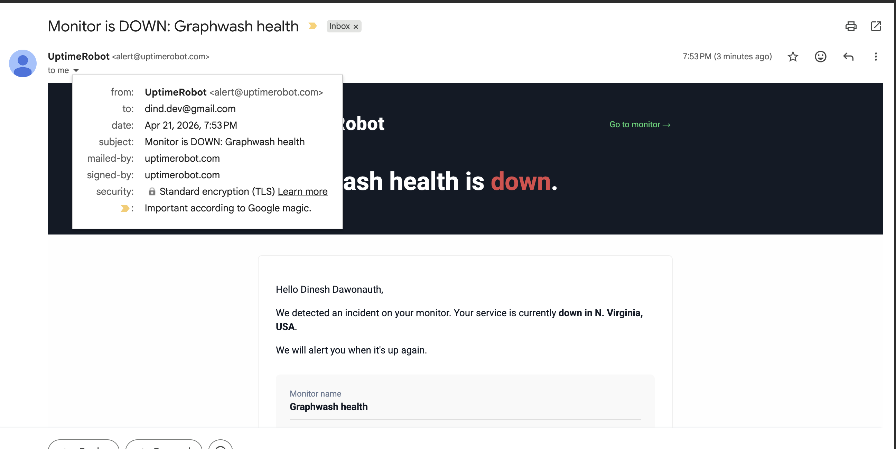
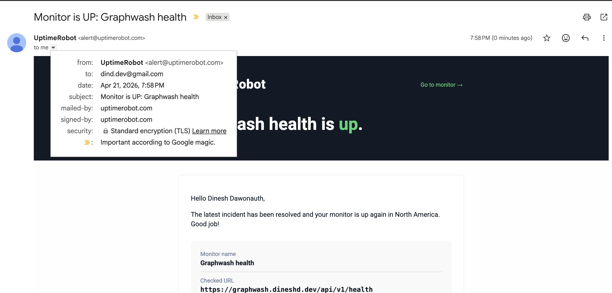

# Monitoring

Operational runbook for the graphwash uptime monitor configured during the
T-020 Pilot-phase spike on 2026-04-21.

## Overview

graphwash uses the UptimeRobot free tier with a 5-minute keyword monitor on
`/api/v1/health`. Alerts are sent to `dind.dev@gmail.com`. The 5-minute
interval is the free-tier minimum and matches the PRD section 17 monitoring
threshold (widened from `>2 min` during T-020 spike closure when
UptimeRobot's 2026 free tier was found to floor at 5 min, not 2 min as the
PRD originally assumed).

## Monitor configuration

| Field           | Value                                                                           |
| --------------- | ------------------------------------------------------------------------------- |
| Monitor type    | Keyword                                                                         |
| Probe URL       | `https://graphwash.dineshd.dev/api/v1/health`                                   |
| Keyword         | `ok`                                                                            |
| Alert condition | keyword absent (UptimeRobot field labelled "alert when keyword does not exist") |
| Interval        | 5 minutes (free-tier minimum)                                                   |
| Probe region    | North America (specific city varies; see "Probe source IPs" below)              |
| Alert contact   | signup email `dind.dev@gmail.com` (verified during account creation)            |

## Setup steps

Recreate the monitor from scratch with the following procedure.

1. Sign up at uptimerobot.com (free plan, email plus password).
2. Verify the email link.
3. At the top of the dashboard, click "+ Add new monitor" (label may vary
   by region).
4. In the create form, pick `Keyword` from the Monitor Type dropdown.
   Friendly name: `Graphwash health`. URL:
   `https://graphwash.dineshd.dev/api/v1/health`. Keyword Type:
   `not exists`. Keyword: `ok`. Interval: `5 minutes`.
5. Scroll to "Select Alert Contacts To Notify" and tick the email contact
   (the signup email is auto-added but NOT auto-ticked on new monitors,
   which is a common gotcha).
6. Save.

## Alert evidence, T-020 spike kill-signal verification (2026-04-21)

Procedure: stop the graphwash container, capture T0; wait for the DOWN
email and capture T1 from its `Date:` header; restart the container,
capture T_restart; wait for the UP email and capture T2.

Timeline (canonical UTC, VPS clock):

| Event                       | Timestamp (UTC)      | Epoch      |
| --------------------------- | -------------------- | ---------- |
| T0 (container stop)         | 2026-04-21T23:50:53Z | 1776815453 |
| T1 (DOWN email Date header) | 2026-04-21T23:53:50Z | 1776815630 |
| T_restart (container start) | 2026-04-21T23:55:17Z | 1776815717 |
| T_healthy (200 from Caddy)  | 2026-04-21T23:55:20Z | 1776815720 |
| T2 (UP email Date header)   | 2026-04-21T23:58:55Z | 1776815935 |

Latencies:

| Metric                              | Value    |
| ----------------------------------- | -------- |
| DOWN alert latency (T1 - T0)        | 2 m 57 s |
| Container downtime (T_restart - T0) | 4 m 24 s |
| UP alert latency (T2 - T_healthy)   | 3 m 35 s |

Verdict: cleared the 5-minute spike target with 2 m 3 s headroom.





## Probe source IPs observed

| Region           | IP            |
| ---------------- | ------------- |
| N. Virginia, USA | 34.198.201.66 |
| Ohio, USA        | 52.15.147.27  |

UptimeRobot rotates probe regions per check, so the source-IP set is
plural. Do not allowlist on a single IP.

## Restart drill

Re-run the kill-signal verification with the following commands.

```bash
T0=$(date -u +"%Y-%m-%dT%H:%M:%SZ")
echo "T0: $T0"
ssh root@157.180.94.145 'docker stop graphwash'
curl -sS -o /dev/null -w "HTTP %{http_code}\n" \
    https://graphwash.dineshd.dev/api/v1/health
```

Wait for the DOWN email. Open it in Gmail, then "Show original" to read
the raw `Date:` header (RFC2822 format with seconds). That value is T1.

Restart:

```bash
T_RESTART=$(date -u +"%Y-%m-%dT%H:%M:%SZ")
echo "T_restart: $T_RESTART"
ssh root@157.180.94.145 'docker start graphwash'
sleep 3
curl -sS https://graphwash.dineshd.dev/api/v1/health
```

Wait for the UP email. Same procedure for T2. Compute `T1 - T0` and
`T2 - T_restart` and confirm both are under 5 minutes.

## Limitations

- Free-tier minimum interval is 5 minutes (60-second checks paywalled).
- SSL expiry monitoring is paywalled. Caddy auto-renews via ACME, so this
  is not currently a concern (see `docs/ops/hetzner.md` section T-019 for
  cert-issuance latency).
- Only one alert region is available on free; paid plans add multi-region
  probing.
- Probe IPs rotate; no fixed allowlist is possible.
- UptimeRobot incident timestamps in the email body render in
  account-local timezone, which currently appears to be approximately
  UTC-2:30 (account default; not configurable on free). The `Date:`
  header is the canonical truth; ignore the body's "Incident started at"
  field for latency math.
